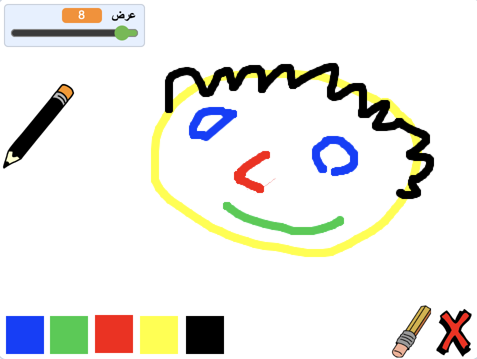

--- no-print ---

هذا هو إصدار **Scratch 3** من المشروع. هناك أيضًا [ إصدار Scratch 2 للمشروع](https://projects.raspberrypi.org/ar-SA/projects/paint-box-scratch2).

--- /no-print ---

## المقدمة

اصنع برنامج الرسام الخاص بك!

### ما الذي ستصنعه

--- no-print --- انقر على العلم الأخضر للبدء. استخدم الماوس لتحريك قلم الرصاص واضغط باستمرار على زر الماوس الأيسر للرسم. انقر على لون لتغيير لون القلم الرصاص. انقر على الممحاة لتفعيل استخدامها ، واستخدمها لمحو عملك. لمسح الصفحة ، انقر فوق رمز التقاطع (علامة الاكس).

  <iframe allowtransparency="true" width="485" height="402" src="//scratch.mit.edu/projects/embed/331747919/?autostart=false" frameborder="0" scrolling="no"></iframe>
  

--- /no-print ---

--- print-only --- سوف تنقر على العلم الأخضر للبدء ، و ستستخدم الماوس لتحريك القلم الرصاص و ستنقر مع الاستمرار بالضغط على زر الماوس الأيسر للرسم. النقر على لون سيغير لون القلم الرصاص ، و النقر على أداة الممحاة سوف يجعل الممحاة تبدأ العمل!

 --- /print-only ---

--- collapse ---
---
title: ما الذي ستتعلمه
---

+ اضافة ملحق القلم في Scratch
+ استخدام عملية البث للتحكم بكائن في Scratch
+ كيفية الاستجابة لأحداث الماوس في Scratch --- /collapse ---

--- collapse ---
---
title: ما ستحتاج إليه
---

### الأجهزة

+ جهاز كمبيوتر يدعم تشغيل برنامج Scratch 3

### البرامج

+ برنامج Scratch 3 (سواء أكان [عبر الإنترنت](https://rpf.io/scratchon){:target="_blank"} أو [دون اتصال بالإنترنت](https://rpf.io/scratchoff){:target="_blank"})

### للتحميل

+ [للبدء بالمشروع دون الاتصال بالانترنت](https://rpf.io/p/ar-SA/paint-box-go){:target="_blank"}

--- /collapse ---

--- collapse ---
---
title: معلومات إضافية للمعلمين
---

إذا كنت بحاجة إلى طباعة هذا المشروع، فالرجاء استخدام [نسخة متوافقة مع الطابعة](https://projects.raspberrypi.org/ar-SA/projects/paint-box/print){:target="_blank"}.

يمكنك الحصول على [المشروع كاملاً من هنا](https://rpf.io/p/ar-SA/paint-box-get){:target="_blank"}. --- /collapse ---