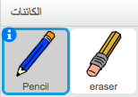
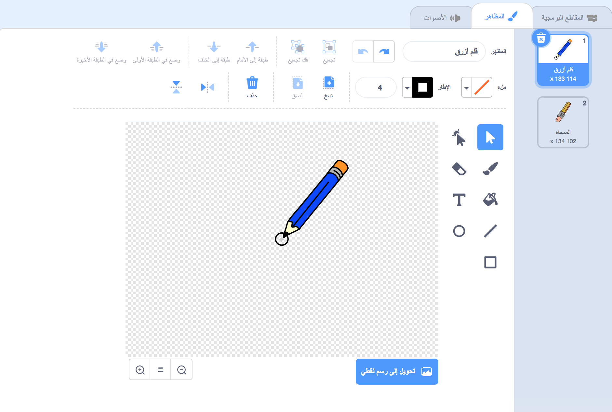

## إنشاء قلم رصاص

لنبدأ بإنشاء قلم رصاص يمكن استخدامه للرسم على المنصة.

--- task --- افتح مشروع Scratch المبدئي 'صندوق الرسم'.

**بالاتصال بالانترنت**: افتح المشروع المبدئي من هنا [rpf.io/paint-box-on](http://rpf.io/paint-box-on){:target="_blank"}

اذا كنت تملك حساب على منصة سكراتش Scratch فيمكنك عمل نسخة بالنقر على **Remix**.

**دون اتصال بالانترنت**: افتح [المشروع المبدئي](http://rpf.io/p/ar-SA/paint-box-go){:target="_blank"} عبر المحرر الموجود على جهازك.

اذا كنت تحتاج تنزيل و تركيب محرر Scratch للعمل دون اتصال بالانترنت, فيمكنك ايجاده على الرابط [rpf.io/scratchoff](http://rpf.io/scratchoff){:target="_blank"}

في المشروع المبدئي، سترى كائنات القلم الرصاص و الممحاة:

 --- /task ---

--- task ---

أضف ملحق القلم لمشروعك.

[[[generic-scratch3-add-pen-extension]]]

--- /task ---

--- task ---

أضف بعض التعليمات البرمجية لكائن القلم الرصاص لجعله يتبع مؤشر الماوس `باستمرار`{:class="block3control"} حتى يمكنك الرسم:


```blocks3
عند نقر ⚑ :: events
كرر باستمرار 
  اذهب إلى (مؤشر الفأرة v) :: motion :: control
end
```

--- /task ---

--- task --- انقر على العلم الأخضر ثم حرك مؤشر الفأرة فوق منصة العمل لتتأكد ما إذا كانت تعليماتك البرمجية تعمل أم لا. --- /task ---

بعد ذلك، لنجعل قلم الرصاص يرسم فقط `إذا`{:class="blockcontrol"} تم النقر فوق الماوس.

--- task --- أضف هذه التعليمة البرمجية إلى كائن قلم الرصاص:


```blocks3
when flag clicked
forever
  go to (mouse pointer v)

+ if <mouse down?> then
  pen down
  else
  pen up
end
```

--- /task ---

--- task --- اختبر تعليماتك البرمجية مرة آخرى. هذه المرة ، حرِّك القلم الرصاص فوق منصة العمل و اضغط باستمرار على زر الماوس. هل يمكنك الآن الرسم بالقلم؟

 --- /task ---

--- collapse ---
---
title: هل قلمك الرصاص لا يرسم من طرفه ؟
---

اذا كان الخط الذي يرسمه القلم الرصاص يبدو و كأنه يأتي من منتصف القلم، فيجب عليك تغيير كائن القلم بحيث يبدأ الرسم من طرف القلم الخاص بالكتابة.

لعمل ذلك انقر على كائن القلم, بعد ذلك انقر على علامة التبويب **المظاهر**.

حرك مظهر القلم بحيث يصبح طرف القلم **تماماً فوق** نقطة المركز و هي دائرة رمادية موجودة بالقرب من المظهر.



الآن حرك قلم الرصاص على منصة العمل و ارسم. يجب على القلم الآن أن يرسم خطاً من طرفه.

--- /collapse ---