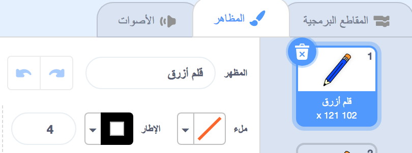
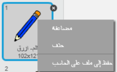
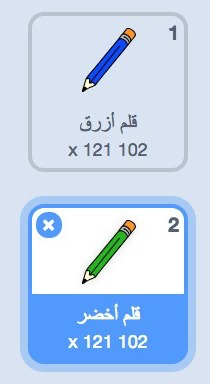

## أقلام ملونة

الآن سنضيف أقلامًا ملوَّنة مختلفة إلى المشروع لنسمح للمستخدم بالاختيار من بينها.

--- task ---

انقر فوق علامة تبويب الأزياء في كائن "قلم الرصاص".

أعد تسمية مظهر كائن `pencil-a` إلى `قلم أزرق`



--- /task ---

--- task ---

انقر بزر الماوس الأيمن على زي قلم ازرق وحدد **مضاعفة**.



--- /task ---

--- task ---

أعد تسمية المظهر الجديد بالاسم 'قلم أخضر', و لوّن القلم باللون الأخضر.



--- /task ---

--- task ---

أنشئ كائنين جديدين: مربع أزرق و مربع أخضر. هذه المربعات ستكون للإختيار بين القلمين الأزرق و الأخضر.


--- /task ---

--- task ---

أعد تسمية الكائنين بالتسمية التالية: 'أزرق' و 'أخضر'

[[[generic-scratch3-rename-sprite]]]

--- /task ---

--- task ---

ثم انقر على كائن القلم لاضافة هذه التعليمات البرمجية: 


```blocks3
when this sprite clicked
broadcast (اخضر v)
```

[[[generic-scratch3-broadcast-message]]]

--- /task ---

يجب على كائن القلم أن يستمع إلى رسالة "أخضر" و يستجيب بتغيير مظهره ولون خط القلم.

--- task ---

انتقل إلى كائن القلم. أضف بعض التعليمات البرمجية بحيث عندما يستقبل الكائن بث `أخضر`{:class="block3events"}, فإنه يتبدل إلى مظهر القلم الأخضر و يغير لون الكتابة إلى أخضر.


```blocks3
when I receive [اخضر v]
switch costume to (قلم أخضر v)
set pen color to [#00CC44]
```

أضف بعض التعليمات البرمجية إلى الكائن 'أخضر' بحيث عندما يتم النقر عليه,يقوم `ببث`{:class="block3events"} الرسالة "أخضر".

--- /task ---

و الآن بطريقة مشابهة سنضيف تعليمات برمجية تمكنك من تحويل لون القلم إلى أزرق.

--- task ---

انقر على كائن المربع الأزرق و أضف هذه التعليمات البرمجية:


```blocks3
when this sprite clicked
broadcast (أزرق v)
```

ثم انقر فوق رمز قلم الرصاص وأضف هذه التعليمات البرمجية:


```blocks3
when I receive [أزرق v]
switch costume to (قلم رصاص أزرق v)
set pen color to [#0000ff]
```

--- /task --- 

--- task ---

واخيراً, أضف هذه التعليمات البرمجية لتحديد اللون الذي سيكتب به كائن القلم في بداية البرنامج، و للتأكد من أن صفحة الرسم ستكون خالية عندما يبدأ البرنامج.


```blocks3
when flag clicked
+erase all
+switch costume to (قلم رصاص أزرق v)
+set pen color to [#0035FF]
forever
  go to (mouse pointer v)
if <mouse down?> then
  pen down
  else
  pen up
end
```

--- /task ---

إذا كنت تفضل ذلك، يمكنك جعل البرنامج يبدأ الرسم بقلم ذو لون مختلف.

--- task ---

اختبر تعليماتك البرمجية. هل يمكنك التبديل بين ألوان القلم الأزرق والأخضر بالنقر على كائنات المربع الأزرق و الأخضر؟


--- /task ---