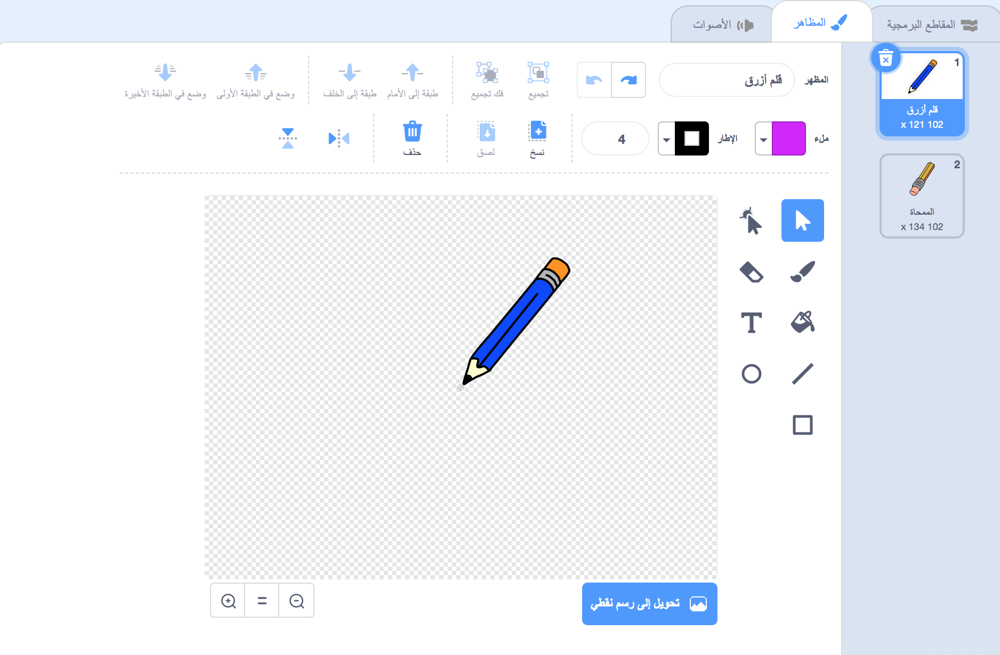

## إنشاء قلم رصاص

لنبدأ بإنشاء قلم رصاص يمكن استخدامه للرسم على المنصة.

+ افتح مشروع Scratch التالي "Paintbox" عبر الإنترنت على [jumpto.cc/paint-go](http://jumpto.cc/paint-go){:target="_blank"} أو تحميله من <http://jumpto.cc/paint-get>{:target="_blank"} ثم افتحه إذا كنت تستخدم المحرر دون اتصال.

سترى قلم رصاص وممحاة:


+ إضافة بعض التعليمات البرمجية إلى كائن قلم الرصاص لتجعله يتبع الماوس `للأبد`{:class="blockcontrol"} بحيث يمكنك الرسم:

```blocks
    عند نقر العلم
كرر باستمرار 
  اذهب إلى [مؤشر الماوس V]
النهايه
```

+ لتختبر هذه التعليمة البرمجية انقر فوق العلم ثم قم بتحريك الماوس في كل مكان على المنصة.

بعد ذلك، لنجعل قلم الرصاص يرسم فقط `إذا`{:class="blockcontrol"} تم النقر فوق الماوس. أضف هذه التعليمة البرمجية إلى كائن قلم الرصاص.

+ أضف هذا الرمز إلى قائمة رموزك المتحركة:


+ اختبر شفرتك مرة أخرى. في هذه المرة ، حرِّك القلم الرصاص حول الجزء الرئيسي واضغط باستمرار على زر الماوس. هل يمكنك الرسم بقلم الرصاص؟


## \--- collapse \---

## title: إذا كنت تواجه مشاكل...

إذا كان قلمك يبدو وكأنه يرسم الخط من منتصف قلم الرصاص بدلاً من الطرف ، فسوف تحتاج إلى تغيير مركز قلم الرصاص.



يجب وضع التقاطع الخاص بقلم الرصاص **أسفل** رأس القلم مباشرةً، وليس على طرف قلم الرصاص.

لا يتم تسجيل أي تغيير في "مركز الزي" الخاص بـ sprite حتى يتم النقر فوق علامة تبويب أخرى ، لذلك انقر فوق زي آخر ، أو على علامة التبويب "Scripts" لوضع اللمسات الأخيرة على تغييراتك في مركز الملابس.

\--- /collapse \---