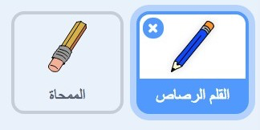

## إنشاء قلم رصاص

لنبدأ بإنشاء قلم رصاص يمكن استخدامه للرسم على المنصة.

+ افتح مشروع 'علبة الألوان' لبرنامج Scratch عبر الإنترنت على at jumpto.cc/paint-go أو يمكنك تنزيله من jumpto.cc/paint-get ثم فتحه إذا كنت تستخدم محرِّر الرسم الموجود على الجهاز.

سترى قلم رصاص وممحاة:



+ لأنك ستستخدم الماوس للرسم، ستحتاج إلى برمجة القلم الرصاص ليتبع الماوس في حلقة كرِّر باستمرار{:class="blockcontrol"}. أضف هذه التعليمة البرمجية إلى كائن القلم الرصاص:

```blocks
    when flag clicked
    forever
      go to [mouse pointer v]
    end
```

+ اختبر هذه التعليمة البرمجية بالنقر فوق العلم ثم تحريك الماوس في كل مكان على المنصة.

بعد ذلك، لنجعل قلم الرصاص يرسم إذا{:class="blockcontrol"} تم النقر فوق الماوس. أضف هذه التعليمة البرمجية إلى كائن قلم الرصاص.

+ أضف هذا الرمز إلى قائمة رموزك المتحركة:


+ اختبر شفرتك مرة أخرى. في هذه المرة ، حرِّك القلم الرصاص حول الجزء الرئيسي واضغط باستمرار على زر الماوس. هل يمكنك الرسم بقلم الرصاص؟


## المختصر

## العنوان: إذا كنت تواجه مشاكل...

إذا كان قلمك يبدو وكأنه يرسم الخط من منتصف قلم الرصاص بدلاً من الطرف ، فسوف تحتاج إلى تغيير مركز الزي الخاص بك.


يجب وضع التقاطع الخاص بالقلم الرصاص ** أسفله مباشرةً ** رأس القلم ، وليس على طرف قلم الرصاص.

لا يتم تسجيل أي تغيير في "مركز الزي" الخاص بـ sprite حتى يتم النقر فوق علامة تبويب أخرى ، لذلك انقر فوق زي آخر ، أو على علامة التبويب "Scripts" لوضع اللمسات الأخيرة على تغييراتك في مركز الملابس.

المختصر