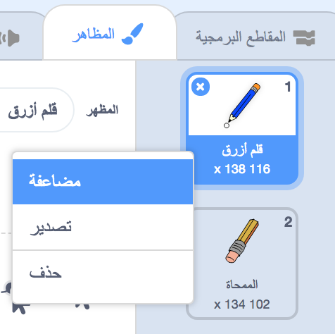
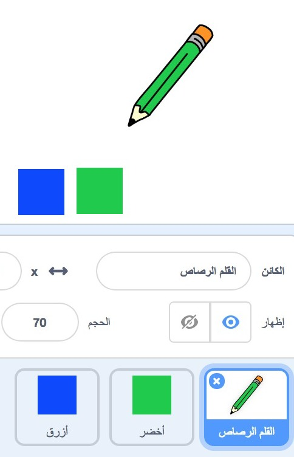

## أقلام ملونة

لنضِف أقلامًا ملوَّنة مختلفة إلى المشروع لنسمح للمستخدم بالاختيار من بينها.

+ انقر فوق كائن القلم الرصاص، ثم انقر فوق 'المظاهر' وضاعف المظهر 'قلم أزرق'.



+ غيِّر اسم المظهر الجديد إلى 'قلم أخضر'، ولوِّن قلم الرصاص باللون الأخضر.


[[[generic-scratch-rename-sprite]]]

+ أنشئ كائنَين جديدَين لتستخدمهما في تحديد القلم الأزرق أو الأخضر. سوف تستخدم هذه لتحديد قلم رصاص أزرق أو أخضر.



+ اعد تسمية الكائنين الخاصين بك بالتسمية التالية: "ازرق" و "أخضر"

+ أضف رمزا الى الكائن الأخضر بحيث عند النقر عليه سيطلق البث.الرسالة "اخضر" ستقول بتغيير قلم الرصاص ولونه: لقلم الرصاص


[[[generic-scratch-broadcast-message]]]

+ التبديل إلى كائن قلم الرصاص الخاص بك عند النقر فوق أيقونة محدد اللون الأخضر، ستحتاج إلى بث{:class="blockevents"} رسالة إلى القلم الرصاص لتأمره بتغيير مظهره ولون خطه.


لتعيين القلم الرصاص على اللون إلى اللون الأخضر ، انقر فوق المربع الملون في ` لون القلم المحدد ` {: class = "blockpen"} block ، وانقر على رمز الكائن الأخضر لاختيار اللون الأخضر نفسه الذي يظهر فيه لون قلمك.

+ يمكنك الآن عمل نفس الإجراء لرمز القلم الأزرق: أضف هذا الرمز إلى رمز مربع أزرق اللون:

```blocks
when this sprite clicked
broadcast [blue v]
```

...أضف هذا الرمز إلى قائمة رموزك المتحركة:

```blocks
أخيرًا، تحتاج إلى أن تأمر كائن القلم الرصاص باختيار المظهر ولون القلم المناسبَين، وكذا مسح الشاشة، عند بدء المشروع. أضف هذه التعليمة البرمجية إلى بداية التعليمة البرمجية عند النقر فوق العلم{:class="blockevents"} الخاصة بالقلم الرصاص (قبل حلقة كرِّر باستمرار{:class="blockcontrol"})
```

+ أخيرا، أضف التعليمات البرمجية لإخبار قلم رصاص أي اللونين تبدأ به، وتأكد من أن الشاشة واضحة.


We chose to start with blue but if you prefer, you can start with a different colour pencil.

+ Test out your project. Can you switch between blue and green pens by clicking on the blue or green square sprites?

