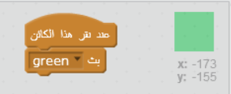
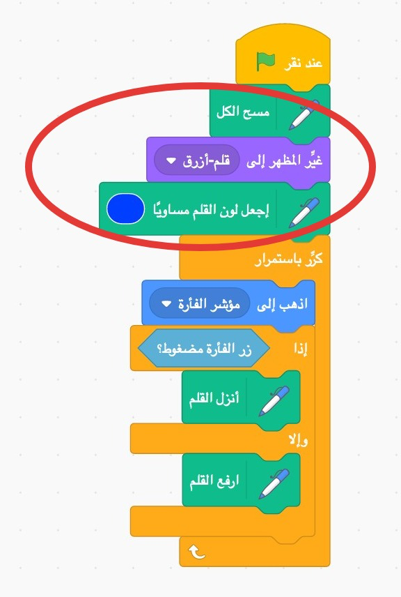

## أقلام ملونة

لنضِف أقلامًا ملوَّنة مختلفة إلى المشروع لنسمح للمستخدم بالاختيار من بينها.

+ انقر فوق كائن القلم الرصاص، ثم انقر فوق 'المظاهر' وضاعف المظهر 'قلم أزرق'.


+ غيِّر اسم المظهر الجديد إلى 'قلم أخضر'، ولوِّن قلم الرصاص باللون الأخضر.


[[[generic-scratch-rename-sprite]]]

+ أنشئ كائنَين جديدَين-أحدهما مربع أزرق والآخر مربع أخضر. سوف تستخدمهما لتحديد قلم رصاص أزرق أو أخضر.


+ اعد تسمية الكائنين الخاصين بك بالتسمية التالية: "ازرق" و "أخضر"

+ أضف رمزًا إلى الكائن "الأخضر" بحيث عند النقر عليه، سيتم`بث<0> {:class="blockevents"}. الرسالة "أخضر" لقلم الرصاص، لإخبارها بتغيير لونها وقلم الرصاص.</p></li>
</ul>

<p></p>

<p>[[[generic-scratch-broadcast-message]]]</p>

<ul>
<li>التبديل إلى كائن قلم الرصاص الخاص بك عند النقر فوق أيقونة محدد اللون الأخضر، ستحتاج إلى `بث</0>{:class="blockevents"} رسالة إلى القلم الرصاص لتأمره بتغيير مظهره ولون خطه.</li> </ul> 
    
    
    
    لتعيين القلم الرصاص على اللون إلى اللون الأخضر ، انقر فوق المربع الملون في ` لون القلم المحدد `{:class="blockpen"}، وانقر على رمز الكائن الأخضر لاختيار اللون الأخضر نفسه الذي يظهر فيه لون قلمك.
    
    + يمكنك الآن عمل نفس الإجراء لرمز القلم الأزرق: أضف هذا الرمز إلى رمز المربع أزرق اللون:
    
    ```blocks
    عند نقر هذا الكائن
    بث [blue v]
    ```
    
    ...أضف هذا الرمز إلى قائمة رموزك المتحركة:
    
    ```blocks
    عندما تستقبل [blue v]
    غيّر المظهر إلى [pencil-blue v]
    اجعل لون القلم مساوياً [#0000ff]
    ```
    
    + أخيرا، أضف التعليمات البرمجية لإخبار قلم رصاص أي اللونين تبدأ به، وتأكد من أن الشاشة واضحة.
    
    
    
    لقد اخترنا البدء باللون الأزرق ولكن إذا كنت لا تفضل ذلك ، فيمكنك البدء بقلم رصاص مختلف.
    
    + اختبر مشروعك. هل يمكنك التحويل بين القلمين الأزرق والأخضر؟
    
    