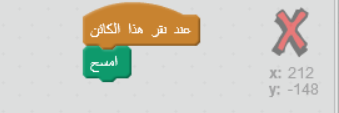
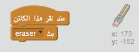
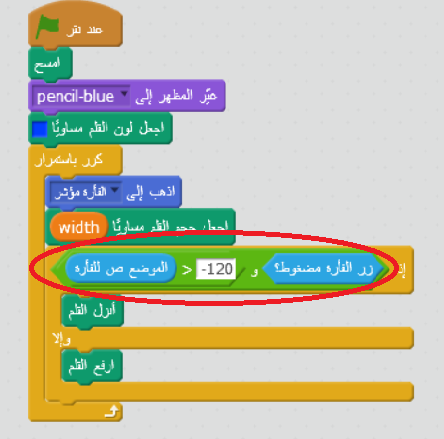

## أخطاء الرسم

أحيانًا تحدث أخطاء أثناء الرسم، سنضيف زر 'مسح' وممحاة إلى المشروع.

+ أضف الكود "X-block" - ستجده في المكتبة ، في قسم الحروف. لوِّنه باللون الأحمر. سيصبح هذا الزر" مسح".


+ أضف تعليمة برمجية إلى زر الإلغاء الجديد لمسح المنصة عند النقر عليه.



لاحظ أنك لا تحتاج إلى إرسال رسالة لمسح المنصة، لأن أي كائن يمكن أن يفعل ذلك!

ربما لاحظتَ أن كائن القلم الرصاص يشتمل على مظهر الممحاة:


+ يحتوي مشروعك على كائن محدد الممحاة. انقر عليه بزر الفأرة الأيمن واختر "إظهار". سيكون شكل المنصة كما يلي:


+ يمكنك عندئذٍ إضافة تعليمة برمجية إلى كائن محدد الممحاة لتأمر القلم الرصاص بالتحول إلى ممحاة.



عندما يتلقى القلم هذه رسالة "الممحاة"، يمكنك إنشاء ممحاة بتحويل مظهر القلم إلى ممحاة، وتحويل لون القلم إلى اللون الأبيض-نفس اللون كمرحله!

+ أضف رمزًا لإنشاء الممحاة

\--- hints \--- \--- hint \--- اضف رمزا لقلم الرصاص: **عندما اتلقى** من**الممحاة**رسالة **انتقل الى** الممحاة **اختيار لون القلم** الابيض \--- /hint \--- \--- hint \--- هنا سترى كيف تظهر الرموز داخل أقلام االرصاص:

```blocks
عندما تستقبل [eraser v]
غيّر المظهر إلى [eraser v]
اجعل لون القلم مساوياً [#FFFFFF]
```

\--- /hint \--- \--- /hints \---

+ اختبر مشروعك لتعرف هل يمكنك مسح المنصة ومحو ما رسمته أم لا.


توجد مشكلة واحدة أخرى بالنسبة إلى القلم- حيث يمكنك أن ترسم في أي مكان على المنصة حتى بالقرب من الأيقونات المحدِّدة!


لحل هذه المشكلة، يمكنك ان تأمر قلم الرصاص بالا يرسم الا إذا تم النقر فوق الماوس *و* إذا y-وموقف الماوس أكبر من-120:



+ اختبر مشروعك؛ من المفترض الآن أنك لن تستطيع الرسم بالقرب من الأيقونات المحدِّدة.

