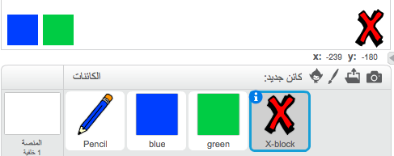
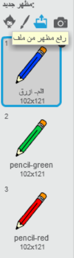

## التراجع عن الأخطاء

أحيانًا تحدث أخطاء أثناء الرسم، لذلك سنضيف زر 'مسح' و زر للممحاة.

--- task --- أضف كائن Block-X من قسم حروف في مكتبة الكائنات. لون مظهر الكائن باللون الأحمر و صغر حجمه قليلاً. هذا الكائن سيكون زر 'مسح'.

[[[generic-scratch3-sprite-from-library]]]

 ---/task--

--- task --- أضف التعليمه البرمجية التالية إلى كائن 'X-block' لمسح منصة العمل عندما يتم النقر على هذا الكائن.


```blocks3
عند نقر هذا الكائن
مسح الكل
```

--- /task ---

لا تحتاج إلى استخدام `بث`{:class="block3events"} لمسح كامل محتويات منصة العمل, لأن كتلة `مسح الكل`{:class="block3extensions"} block تقوم بهذه العملية.

هل لاحظت بأن كائن القلم الرصاص يحتوي على مظهر للممحاة؟



يحتوي مشروعك على كائن محدد الممحاة.

--- task --- انقر بزر الماوس اليمين على كائن الممحاة هذا و اختر **عرض**. سيكون شكل المنصة كما يلي:

 ---/task---

--- task --- أضف هذه التعليمة البرمجية لكائن الممحاة لارسال بث `'مسح'`{:class="block3events"} عندما يتم النقر على كائن الممحاة.


```blocks3
عند نقر هذا الكائن
بث (مسح v)
```

--- /task ---

عندما يتلقى كائن القلم الرصاص رسالة "الممحاة"، فيفترض أن يقوم بتحويل مظهره إلى مظهر الممحاة، وتحويل لون القلم إلى اللون الأبيض، أي نفس لون منصة العمل!

--- task --- أضف بعض التعليمات البرمجية لإنشاء الممحاة.

--- hints ---
 --- hint --- أضف بعض التعليمات البرمجية لكائن القلم الرصاص: `عندما أتلقى رسالة`{:class="block3events"} `مسح`{:class="block3events"} `غير المظهر إلى الممحاة`{:class="block3looks"} `اجعل لون القلم مساوياً للون`{:class="block3extensions"} الأبيض
--- /hint ---
 --- hint --- هذه هي الكتل البرمجية التي ستحتاجها:

```blocks3
إجعل لون القلم مساوياً لـ [#FFFFFF]
عندما أتلقى [مسح v]
غيِّر المظهر إلى (الممحاة v)
```

--- /hint --- --- hint --- يجب أن تكون التعليمة البرمجية كما يلي: 

```blocks3
عندما أتلقى [مسح v]
غيِّر المظهر إلى (الممحاة v)
إجعل لون القلم مساوياً لـ [#FFFFFF]
```

--- /hint ------ /hints --- --- /task ---

--- task --- اختبر مشروعك لترى هل يمكنك مسح كامل محتويات منصة العمل و هل يمكنك مسح كتابات القلم.

 --- /task ---

توجد مشكلة واحدة آخرى بالنسبة إلى القلم: هل لاحظت أنه يمكنك أن ترسم في أي مكان على منصة العمل حتى بالقرب من زر 'مسح' و زر 'الممحاة'!


--- task --- لحل هذه المشكلة, غير التعليمات البرمجية بحيث يكون القلم في حالة نزول فقط إذا تم النقر بالماوس **و** كان `موقع ص` للماوس أكبر من `-120`:


```blocks3
عند نقر ⚑
مسح الكل
غيِّر المظهر إلى (قلم أزرق v)
إجعل لون القلم مساوياً لـ [#0035FF]
كرِّر باستمرار 
  اذهب إلى (مؤشر الفأرة v)
  + إذا <<مضغوط؟ الفأرة زر> و <(الموضع ص للفأرة) > [-120]>> 
  +   أنزل القلم
  + وإلا 
  +   ارفع القلم
  + end
end
```

--- /task ---

--- task --- اختبر تعليماتك البرمجية. الآن بعد حل المشكلة يفترض أنك غير قادر على الرسم بجوار الأزرار الموجودة على منصة العمل.

 --- /task ---