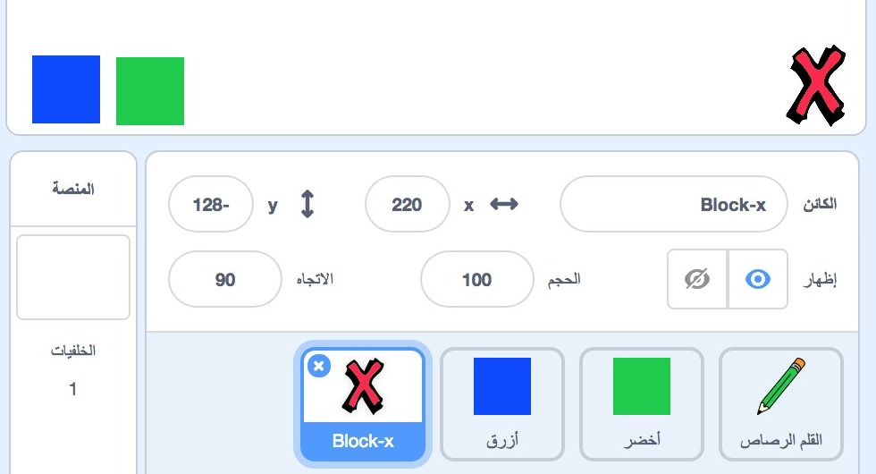
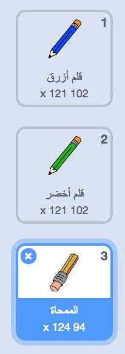

## أخطاء الرسم

لأنه أحيانًا ما تحدث أخطاء أثناء الرسم، سنضيف زر 'مسح' وممحاة إلى المشروع.

+ أضِف زرًا لمسح المنصة. لتفعل ذلك، أضف كائن الحرف 'X-block' إلى المنصة. لوِّنه باللون الأحمر. سيصبح هذا الزر" مسح".



+ أضف تعليمة برمجية إلى زر الإلغاء الجديد لمسح المنصة عند النقر عليه.


لاحظ أنك لا تحتاج إلى إرسال رسالة لمسح المنصة، لأن أي كائن يمكن أن يفعل ذلك!

ربما لاحظتَ أن كائن القلم الرصاص يشتمل على مظهر لممحاة:



+ يحتوي مشروعك على كائن محدد الممحاة. Right click on this sprite and choose 'show'. Here is how your stage should look:


+ Add code to the eraser sprite, to tell the pencil to switch to an eraser when the sprite is clicked.


When the pencil receives the "eraser" message, you can switch the pencil costume to the eraser, and switch the pencil colour to white - the same colour as the stage!

+ Add some code to create the eraser

\--- hints \--- \--- hint \--- Add some code to the pencil sprite: **When I receive** the **eraser** message **Switch to costume** eraser **Set pen color** to white \--- /hint \--- \--- hint \--- Here is how the code inside the pencil sprite should look:

```blocks
when I receive [eraser v]
switch costume to [eraser v]
set pen color to [#FFFFFF]
```

\--- /hint \--- \--- /hints \---

+ Test your project, to see if you can clear and erase on the stage.


There's one more problem with the pencil - you can draw anywhere on the stage, including near the selector icons!


To fix this, tell the pencil only to draw if the mouse is clicked *and* if the y-position of the mouse is greater than -120:


+ Test your project; you now shouldn't be able to draw near the selector blocks.

