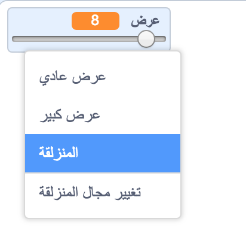

## تغيير عرض القلم الرصاص

الآن سنضيف بعض التعليمات البرمجية التي ستسمح لمن يستخدم برنامجك بأن يرسم بأقلام ذات عرض مختلف.

--- task ---

أولا ، أضف متغير جديد بالاسم `العرض`{:class="block3variables"}.

[[[generic-scratch3-add-variable]]]

--- /task ---

--- task ---

أضف هذا السطر**داخل** حلقة التكرار `كرر باستمرار`{:class="block3control"} الموجودة في التعليمات البرمجية الخاصة بكائن القلم الرصاص:

```blocks3
when flag clicked
erase all
switch costume to (قلم رصاص أزرق v)
set pen color to [#0035FF]
forever
go to (mouse pointer v)
+set pen size to (عرض :: variables)
if <<mouse down?> and <(mouse y) > [-120]>> then 
  pen down
  else
  pen up
end
```

--- /task ---

الآن سيتم إعادة تعيين عرض القلم بشكل متكرر بناءاً على قيمة المتغير `العرض`{:class="block3variables"}.

--- task ---

انقر بزر الماوس الأيمين على المتغير `العرض`{:class="block3variables"} الموجود على الزاوية اليسار العلوية لمنصة العمل, ثم انقر على **المنزلقة**.



--- /task ---

يمكنك الآن سحب شريط المنزلقة لتغيير قيمة المتغير.


--- task ---

اختبر المشروع الخاص بك، وانظر إذا كان يمكنك تغيير عرض القلم.


--- /task ---