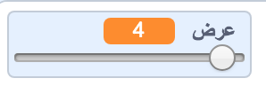
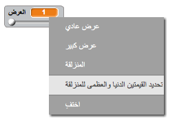

## تغيير عرض قلم الرصاص

نسمح للمستخدم بالرسم باستخدام مجموعة مختلفة الأحجام من الاقلام.

+ أولا ، إضافة متغير جديد يسمى ` العرض ` {: فئة = "blockvariable"}.

[[[generic-scratch-add-variable]]]

+ أضف هذا السطر داخل * * و ` إلى الأبد ` {: class = "blockcontrol"} حلقة من رمز القلم الرصاص:

```blocks
    تعيين حجم القلم (عرض)
```

سيتم الآن تعيين عرض القلم الرصاص مراراً وتكراراً إلى قيمة المتغير 'العرض'.

+ انقر بزر الماوس الأيمن على الشاشة المتغيرة على المسرح وانقر فوق "شريط التمرير".


يمكنك الآن سحب شريط التمرير أسفل المتغير لتغيير قيمته.



+ اختبر المشروع الخاص بك، وانظر إذا كان يمكنك تعديل عرض القلم.


إذا كنت تفضل، يمكنك تعيين قيمة الحد الأدنى والحد الأقصى من 'العرض' المسموح به. للقيام بهذا، انقر بالزر الأيمن على المتغير مرة أخرى وانقر فوق 'تعيين شريط التمرير min و max'. Set the minimum and maximum values of your variable to something more sensible, like 1 and 20.



Keep testing your 'width' variable until you're happy.