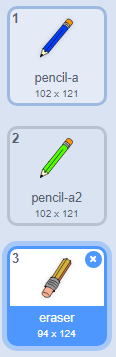
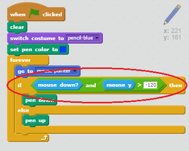

## Səhv etmək

Bəzən səhvlər olur, buna görə də 'təmiz' düyməsini və silgi əlavə edək.

+ 'X-block' sprite əlavə edin - onu kitabxanada məktublar bölümündə tapa bilərsiniz. Kıyafeti qırmızı rəngdə rəngləndirin. Bu, 'aydın' düyməsinə çevriləcəkdir.


+ Çağırıldıqda səhnəni təmizləmək üçün bu sprite kodu əlavə edin.


Səhnəni təmizləmək üçün bir mesaj göndərməyinizə ehtiyac olmadığını nəzərə alsaq, bu sprite olan açıq bloku istifadə edə bilərsiniz.

Yəqin ki, qələm spritinizin silgi kostyumunu ehtiva etdiyini fərq etmişsiniz:



+ Projeniz ayrıca ayrı silgi sprite də daxildir. Bu sprite sağ basın və 'show' seçin. Səhnə necə baxmaq lazımdır:


+ Spreyin vurulduğu zaman qələmi bir silgiyə keçirməyi izah etmək üçün silgi spritinə kod əlavə edin.


Qələm "pozan" mesajı aldığında, qələm kostyumunu pozanya dəyişə bilərsiniz və qələm rəngini ağa dəyişə bilərsiniz - səhnə ilə eyni rəng!

+ Silgi yaratmaq üçün bir neçə kod əlavə edin

\--- ipuçları \--- \--- ipucu \--- qələm sprite bir kod əlavə et: **** aldığımda **silici** mesajı **kostyuma keçmək** silgi **qələm rəngini qoyun** ağa \--- / ipucu \--- \--- ipucu \--- Qələm sprite içərisində kod necə olmalıdır:

```blocks
[eraser v] keçid kostyumunu [silici v] [#FFFFFF] qələm rəngini [
```

\--- / ipucu \--- \--- / göstərişlər \---

+ Səhnədə silmək və silinməyiniz üçün layihəni test edin.


Qələm ilə bir problem daha var - səhnədə hər hansı bir yerə çəkə bilərsiniz, o cümlədən seçici nişanlarının yanında!


Bunu düzəltmək üçün, siçanı y-mövqeyi -120-dən çox olduqda, *və* siçan tıklandığında cəlb etmək üçün qələmə bildirin:



+ Layihənizi test edin; indi seçmə bloklarına yaxınlaşa bilməyəcəksiniz.

