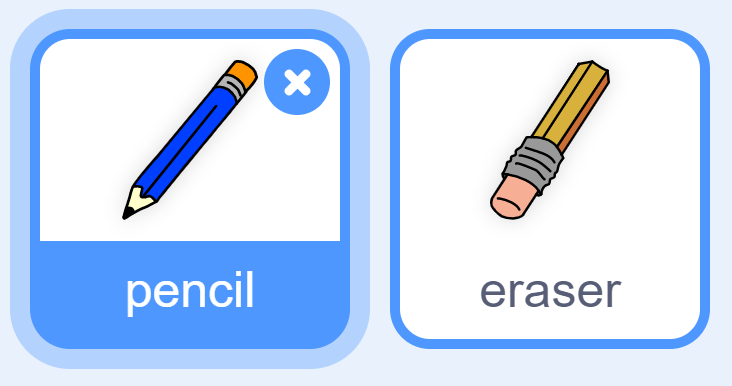

## একটি পেন্সিল তৈরি করুন

স্টেজে/stage আঁকা সম্ভব এমন পেন্সিল তৈরী করে শুরু করুন.

--- task ---

'পেইন্ট বক্স 'Paint box' Scratch starter project টি খুলুন।.

**Online**: starter project টি খুলুন [rpf.io/paint-box-on](https://rpf.io/paint-box-on){:target="_blank"}

আপনার যদি scratch অ্যাকাউন্ট থাকে তবে আপনি **Remix** ক্লিক করে এটির একটি অনুলিপি/copy তৈরি করতে পারেন ।.

**Offline**: অফলাইন এডিটরে [starter project](https://rpf.io/p/bn-IN/paint-box-go){:target="_blank"} খুলুন.

আপনার যদি scratch offline editor ডাউনলোড এবং ইনস্টল করতে হয় তবে আপনি এটি [rpf.io/scratchoff](https://rpf.io/scratchoff){:target="_blank"} এ খুঁজে পেতে পারেন।

Starter project এ আপনার পেন্সিল এবং ইরেজার sprite গুলি দেখতে পাবেন:



--- /task ---

--- task ---

আপনার প্রকল্পে একটি পেন এক্সটেনশন যুক্ত করুন।.

[[[generic-scratch3-add-pen-extension]]]

--- /task ---

--- task ---

পেনসিল sprite এ কিছু কোড যুক্ত করুন যাতে স্প্রাইটটি `forever`{:class="block3control"} মাউস পয়েন্টারকে অনুসরণ করে এবং যাতে আপনি আঁকতে পারেন:


```blocks3
when flag clicked
forever
  go to (mouse pointer v)
end
```

--- /task ---

--- task ---

আপনার কোডটি কাজ করে কিনা তা পরীক্ষা করতে পতাকাটি ক্লিক করুন এবং তারপরে স্টেজের চারপাশে মাউস পয়েন্টারটি সরান।.

--- /task ---

এরপরে, আপনার পেন্সিলটি কেবল তখনি আঁকবে যখন `if`{:class="block3control"} মাউস বোতামটি ক্লিক করা হচ্ছে।.

--- task ---

আপনার পেন্সিল sprite এ এই কোডটি যুক্ত করুন:


```blocks3
when flag clicked
forever
  go to (mouse pointer v)

+ if <mouse down?> then
  pen down
  else
  pen up
end
```

--- /task ---

--- task ---

আপনার কোডটি আবার পরীক্ষা করুন।. এবার, পেনসিলটি স্টেজের চারপাশে সরান এবং মাউস বোতামটি ধরে রাখুন।. আপনি কি আপনার পেন্সিল দিয়ে আঁকতে পারছেন?


--- /task ---

--- collapse ---
---
title: আপনার পেন্সিলটি কি মাথা থেকে আঁকছে না?
---

পেন্সিল দ্বারা অঙ্কনের রেখাটি যদি পেনসিলের মাঝামাঝি অঞ্চল থেকে হয় তবে আপনার পেন্সিল sprite এ পরিবর্তন করতে হবে যাতে মাথাটা sprite এর কেন্দ্রে থাকে।.

আপনার পেন্সিল sprite ক্লিক করুন এবং তারপর **Costumes** এ ক্লিক করুন।.

Costume টি সরান যাতে পেনসিলের মাথা ঠিক কেন্দ্রের উপরে থাকে **just above**.


এখন পেনসিলটি স্টেজের চারদিকে সরিয়ে নিয়ে আঁকুন।. পেন্সিলটি এখন তার মাথা থেকে দাগ টানবে।.

--- /collapse ---
