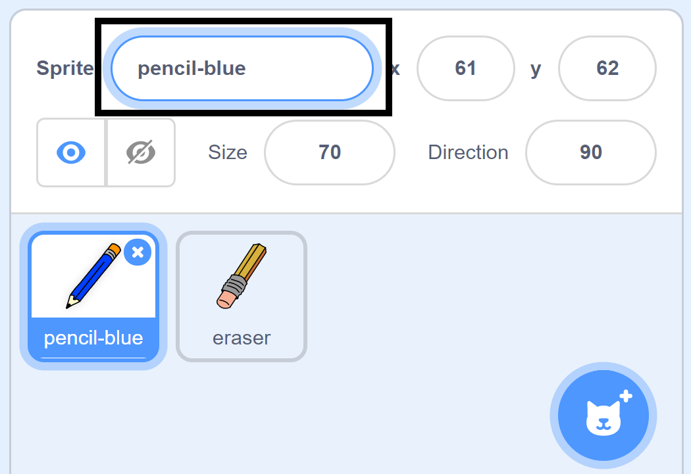

## রঙিন পেন্সিল

এখন আপনি আপনার প্রকল্পে বিভিন্ন রঙিন পেন্সিল যুক্ত করতে যাচ্ছেন এবং সেগুলি ব্যবহারকারীকে বেছে নেওয়ার অনুমতি দিন।.

\--- task \---

নামকরণ করুন `pencil` sprite থেকে `pencil-blue`



\--- /task \---

\--- task \---

পেন্সিল sprite এ right click করুন, এবং 'pencil-blue' costume এর প্রতিলিপি করুন।.


\--- /task \---

\--- task \---

নতুন Costume টির নাম দিন 'pencil-green', এবং পেন্সিলটি সবুজ রঙ করুন।.


\--- /task \---

\--- task \---

দুটি নতুন Sprite আঁকুন: একটি blue square এবং একটি green square. এগুলি নীল এবং সবুজ পেন্সিলের মধ্যে চয়ন করার জন্য।.


\--- /task \---

\--- task \---

নতুন sprites এর নাম পরিবর্তন করুন যাতে তাদের 'নীল' এবং 'সবুজ' বলা যা

[[[generic-scratch3-rename-sprite]]]

\--- /task \---

\--- task \---

'সবুজ' sprite এ কিছু কোড যুক্ত করুন যাতে এই sprite টি ক্লিক করা হয়, তখন এটি ` broadcast ` ।: class= "block3events"} বার্তাটি "সবুজ" করে দেবে.


```blocks3
when this sprite clicked
broadcast (green v)
```

[[[generic-scratch3-broadcast-message]]]

\--- /task \---

পেন্সিল sprite "সবুজ" বার্তাটি নিয়ে, প্রতিক্রিয়া স্বরূপ costume এবং পেন্সিলের রঙটি পরিবর্তন করবে।.

\--- task \---

পেন্সিল sprite এ চলে যান।. কিছু কোড যুক্ত করুন যাতে এই sprite `green`{:class="block3events"} সম্প্রচার বা broadcast পেলে, এটি সবুজ পেন্সিল costume এ পরিবর্তন করে এবং কলমের রঙকে সবুজ করে তোলে।.


```blocks3
when I receive [green v]
switch costume to (pencil-green v)
set pen color to [#00CC44]
```

পেন্সিলটির রঙ সবুজ করতে, `set pen color`{:class="block3extensions"} ব্লকের রঙিন বর্গে ক্লিক করুন এবং তারপরে সবুজ বর্গাকার sprite ক্লিক করুন।.

\--- /task \---

তারপরে একেই ভাবে আপনি পেন্সিলের রঙটি নীলতে পরিবর্তন করতে পারেন।.

\--- task \---

নীল বর্গাকার sprite ক্লিক করুন এবং এই কোডটি যুক্ত করুন:


```blocks3
when this sprite clicked
broadcast (blue v)
```

তারপরে পেন্সিল sprite ক্লিক করুন এবং এই কোডটি যুক্ত করুন:


```blocks3
when I receive [blue v]
switch costume to (pencil-blue v)
set pen color to [#0000ff]
```

\--- /task \---

\--- task \---

অবশেষে, কোন রঙটি পেন্সিল sprite এর সাথে শুরু হবে তা জানানোর জন্য এবং আপনার প্রোগ্রামটি শুরু হওয়ার পরে পর্দাটি পরিষ্কার হয় তা নিশ্চিত করার জন্য এই কোডটি যুক্ত করুন।.


```blocks3
when flag clicked
+erase all
+switch costume to (pencil-blue v)
+set pen color to [#0035FF]
forever
  go to (mouse pointer v)
if <mouse down?> then
  pen down
  else
  pen up
end
```

\--- /task \---

আপনি যদি মনে করেন তবে একটি ভিন্ন রঙের পেন্সিল দিয়ে শুরু করতে পারেন।.

\--- task \---

আপনার কোড পরীক্ষা করুন।. আপনি কি নীল বা সবুজ বর্গাকার sprite গুলিতে ক্লিক করে পেন্সিলের রং নীল ও সবুজে পরিবর্তন করতে পারেন?


\--- /task \---