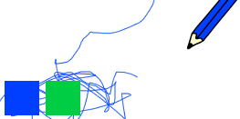

## ভ্রম সংশোধন

কখনও কখনও ভুল হয়, সুতরাং একটি 'clear' button এবং একটি eraser button যুক্ত করুন।.

\--- task \---

গ্রন্থাগার বা library এর অক্ষর বিভাগ থেকে 'X-Block' sprite যুক্ত করুন।. Sprite এর costume টি লালচে করে কিছুটা ছোট করুন।. এই Sprite টি হল 'clear' বোতাম।.

[[[generic-scratch3-sprite-from-library]]]


\--- /task \---

\--- task \---

Sprite ক্লিক করা হলে স্টেজটি সাফ করতে 'X-Block' sprite এ কোড যুক্ত করুন।.


```blocks3
when this sprite clicked
erase all
```

\--- /task \---

আপনার `broadcast`{:class="block3events"} ব্যবহার করার দরকার নেই পর্যায়টি সাফ করার জন্য, `erase all`{:class="block3extensions"} block কাজটি করে।.

আপনি কি পেনসিল sprite টি একটি ইরেজার costume এর অন্তর্ভুক্ত তা দেখতে পান?


আপনার প্রকল্পে একটি পৃথক ইরেজার sprite রয়েছে।.

\--- task \---

Click on this eraser sprite and then select **show**.


Here is how your Stage should look now:


\--- /task \---

\--- task \---

Add code to the eraser sprite to send an `'eraser' broadcast`{:class="block3events"} when the eraser sprite is clicked.


```blocks3
when this sprite clicked
broadcast (eraser v)
```

\--- /task \---

When the pencil sprite receives the 'eraser' message, it should switch its costume to the eraser and switch the pen colour to white, which is the same colour as the Stage!

\--- task \---

Add some code to create the eraser.

\--- hints \--- \--- hint \---

Add some code to the pencil sprite: `When I receive`{:class="block3events"} the `eraser`{:class="block3events"} message `Switch to costume eraser`{:class="block3looks"} `Set pen color`{:class="block3extensions"} to white

\--- /hint \--- \--- hint \---

Here are all the blocks you need:

```blocks3
set pen color to [#FFFFFF]
when I receive [eraser v]

switch costume to (eraser v)
```

\--- /hint \--- \--- hint \---

Here is what the code should look like:


```blocks3
when I receive [eraser v]
switch costume to (eraser v)
set pen color to [#FFFFFF]
```

\--- /hint \--- \--- /hints \--- \--- /task \---

\--- task \---

Test your project to see if you can clear the Stage and erase pencil lines.


\--- /task \---

There's one more problem with the pencil: you can draw anywhere on the Stage, including near the 'clear' and eraser buttons!



\--- task \---

To fix this, change the code so that the pen is only down if the mouse is clicked **and** the `y` position of the mouse pointer is greater than `-120`:


```blocks3
when flag clicked
erase all
switch costume to (pencil-blue v)
set pen color to [#0035FF]
forever
  go to (mouse pointer v)
+if <<mouse down?> and <(mouse y) > [-120]>> then 
  pen down
  else
  pen up
end
```

\--- /task \---

\--- task \---

Test your project. You now should not be able to draw near the buttons.


\--- /task \---