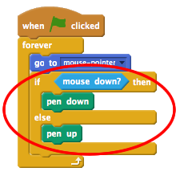

## Fer un llapis

Comencem fent un llapis que es pot utilitzar per dibuixar a l'escenari.

+ Obriu el projecte Scratch 'Paintbox' en línia a [jumpto.cc/paint-go](http://jumpto.cc/paint-go)(: target = "_ blank"} o descarregueu-lo a partir de <http://jumpto.cc/paint-get>(: target = "_ blank") i obriu-lo si feu servir l'editor fora de línia.

Veuràs els sprites de llapis i de goma d'esborrar:


+ Afeeix una mica de codi a l'sprite del llapis per fer-lo seguir el ratolí `per sempre`{: class = "blockcontrol"} perquè puguis dibuixar:

```blocks
    quan es fa clic per sempre a la bandera
      ves al final del [punter del ratolí v]
    final
```

+ Fes clic a la bandera i, a continuació, mou el ratolí per l'escenari per comprovar si funciona el codi.

A continuació, fem que el llapis només dibuixi `si`{: class = "blockcontrol"} s'ha fet clic al ratolí.

+ Afegeix aquest codi al teu sprite de llapis:



+ Torna a provar el codi. Aquesta vegada, mou el llapis per l'escenari i manté premut el botó del ratolí. Es pot dibuixar amb el teu llapis?


## \--- collapse \---

## títol: si tens problemes...

Si el teu llapis sembla dibuixar la línia des del centre del llapis en lloc de la punta, hauràs de canviar el centre de rotació de l'sprite.


El punt de mira del llapis s'ha de posar **just per sota** la punta del llapis, no a la punta del llapis.

Els canvis en el "centre de rotació" d'un sprite no es registren fins que es fa clic a una altra pestanya, llavors fes clic a un altre vestuari o a la pestanya "Scripts" per finalitzar els canvis al centre de vestuari.

\--- /collapse \---