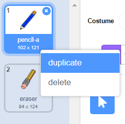

## Llapis de colors

Ara afegirem llapis de colors diferents al vostre projecte i permetreu que l'usuari esculli entre ells.

\--- task \--- Canvieu el nom del `llapis` sprite a `pencil-blue`

 \--- /task \---

\--- task \--- Feu clic amb el botó dret del ratolí sobre el sprite del llapis i dupliqueu el vestit de "llapis blau".

 \--- /task \---

\--- task \--- Anomeneu el vestit nou "llapis verd" i tingueu el color del llapis verd.


\--- /task \---

\--- task \--- Dibuixa dos nous sprites: un quadrat blau i un quadrat verd. Es tracta d’escollir entre el llapis blau i verd.

 \--- /task \---

\--- task \--- Canvieu el nom dels sprites nous de manera que s’anomenin "blau" i "verd"

[[[generic-scratch3-rename-sprite]]]

\--- /task \---

\--- \--- tasca Afegir una mica de codi per al sprite 'verd' de manera que quan es fa clic en aquest element sprite, it `difusions`{: class = ""} block3events el missatge "verd".


```blocks3
quan aquest sprite va fer clic en
difusió (verd v)
```

[[[generic-scratch3-broadcast-message]]] \--- / tasca \---

El sprite de llapis hauria d’escoltar el missatge "verd" i canviar-ne el vestit i el color del llapis.

\--- task \--- Canvieu al vostre sprite de llapis. Afegiu alguns codis de manera que quan aquest sprite rep l’emissió `color verd`{: class = "block3events"}, passa al vestit de llapis verd i canvia el color del llapis a verd.


```blocks3
quan rebo [v v]
canvi de vestit a (llapis-verd v)
establir color de llapis a [# 00CC44]
```

Per configurar el llapis per acolorir-se a verd, feu clic al quadrat de color del bloc `llapis de color`{: class = "block3extensions"} i, a continuació, feu clic al sprite quadrat verd. \--- /task \---

A continuació, a una cosa semblant perquè pugueu canviar el color del llapis al blau.

\--- tasca \--- Feu clic al sprite quadrat blau i afegiu aquest codi:


```blocks3
quan aquest sprite va fer clic en
emissió (v blau)
```

A continuació, feu clic al sprite de llapis i afegiu aquest codi: 

```blocks3
quan rebo [v blau] canvia el vestit de
a (llapis blau v)
configureu el color del llapis a [# 0000ff]
```

\--- /task \---

\--- task \--- Finalment, afegiu aquest codi per dir-li al sprite de llapis amb quin color comencem i per assegurar-vos que la pantalla està clara quan comença el programa.


```blocks3
quan pressionar la bandera
+ esborrar tot
+ commutador de vestuari a (v llapis blau)
+ set color del llapis a [# 0035FF]
per sempre
  Anar a (punter v ratolí)
si <mouse down?> a continuació,
  ploma
  persona
  ploma de dalt
final
```

\--- /task \---

Si ho preferiu, podeu començar amb un llapis de color diferent.

\--- task \--- Posa a prova el teu codi. Podeu canviar entre els colors llapis blau i verd fent clic als sprites quadrats blaus o verds?

 \--- /task \---