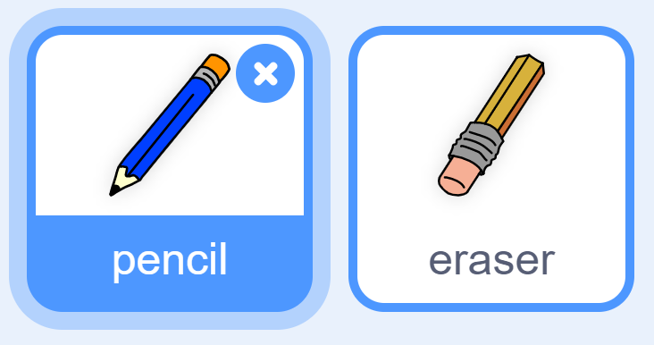

## Fer un llapis

Comencem fent un llapis que es pot utilitzar per dibuixar l'escenari.

+ Obriu el projecte Scratch 'Paintbox' en línia a [jumpto.cc/paint-go](http://jumpto.cc/paint-go)(: target = "_ blank"} o descarregueu-lo a partir de <http://jumpto.cc/paint-get>(: target = "_ blank") i obriu-lo si feu servir l'editor fora de línia.

Veureu llapis i esborranys sprites:



+ Afegiu-hi un codi al sprite del llapis per fer-lo seguir el ratolí `per sempre`{: class = "blockcontrol"} perquè pugueu dibuixar:

```blocks
    quan l'indicador ha fet clic
    per sempre
      aneu al punter del ratolí v
    final
```

+ Feu clic a la bandera i, a continuació, moveu el ratolí a l'escenari per comprovar si funciona el codi.

A continuació, fem que el llapis només dibuixi `si`{: class = "blockcontrol"} s'ha fet clic al mouse.

+ Afegiu aquest codi al vostre sprite de llapis:


+ Torneu a provar el codi. Aquesta vegada, moveu el llapis al voltant de l'escenari i manteniu premut el botó del ratolí. Es pot dibuixar amb el llapis?


## \--- col·lapsar \---

## títol: si teniu problemes ...

Si el vostre llapis sembla dibuixar la línia des del centre del llapis en lloc de la punta, haureu de canviar el vostre centre de disfresses.


L'encaix per al llapis s'ha de col·locar **just per sota** la punta del llapis, no a la punta del llapis.

Els canvis en el "centre de vestimenta" d'un sprite no es registren fins que es fa clic a una altra pestanya, feu clic a un altre vestit o a la pestanya "Scripts" per finalitzar els canvis al centre de vestuari.

\--- / col · lapse \---