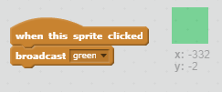

## Llapis de colors

Afegim llapis de colors diferents al vostre projecte i permetem que l'usuari triï entre ells.

+ Feu clic al vostre sprite de llapis, feu clic a "Disfresses" i feu doble el vestit de llapis blau.


+ Canvia el nom del teu nou vestit 'pencil-green', i el color del llapis verd.


[[[generic-scratch-rename-sprite]]]

+ Dibuixa dos nous sprites: un quadrat blau i un quadrat verd. Els utilitzaràs per seleccionar el llapis blau o verd.


+ Canvieu el nom dels vostres sprites de manera que se us cridin "blau" i "verd"

+ Afegir una mica de codi per al sprite 'verd' perquè quan es fa clic, ho farà `emissió`{: class = ""} blockevents el missatge "verd" per al sprite del llapis, comptant per canviar el seu vestuari i un llapis de color.



[[[generic-scratch-broadcast-message]]]

+ Canvia al teu sprite de llapis. Afegir una mica de codi perquè quan aquest element sprite rep el `emissió`{: class = "blockevents"} verd, s'ha de canviar al vestuari llapis verd i canviar el color del llapis de color verd.


Per establir el color del llapis en verd, feu clic a la casella de colors del bloc de colors de `set class`(: class = "blockpen"} i feu clic al sprite verd per triar el mateix color verd que el color del llapis.

+ Ara podeu fer el mateix per a la icona de llapis blau: afegiu aquest codi al quadrat blau sprite:

```blocks
quan aquest sprite ha fet clic a l'emissió
[v blau]
```

... i afegiu aquest codi al llapis sprite:

```blocks
quan rebo [blau v]
canviar de vestit a [pencil-blue v]
conjunt de color de la ploma a [# 0000ff]
```

+ Finalment, afegiu aquest codi per indicar-li el color del llapis amb quin color començar, i assegureu-vos que la pantalla estigui clara.


Triem començar amb blaus, però si ho preferiu, podeu començar amb un llapis de color diferent.

+ Proveu el vostre projecte. Es pot canviar entre les plomes blaves i verdes fent clic als sprites quadrats blaus o verds?

