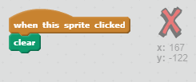

## Cometre errors

De vegades es produeixen errors, així que afegim un botó "clar" i una goma d'esborrar.

+ Afegiu el sprite 'X-block': la trobaràs a la biblioteca, a la secció de lletres. Coloreu el vestit en vermell. Això es convertirà en el botó "clar".


+ Afegiu codi a aquest sprite per esborrar l'etapa quan es fa clic.



Tingueu en compte que no necessiteu enviar un missatge per esborrar l'escenari, només podeu utilitzar el bloc clar d'aquest sprite.

Probablement hàgiu notat que el vostre sprite de llapis inclou un vestit d'esborrany:


+ El vostre projecte també inclou un sprite d'esborrany separat. Feu clic dret sobre aquest sprite i seleccioneu "mostrar". Així és com s'hauria de veure la vostra etapa:


+ Afegiu codi al sprite d'esborrany, per indicar-li al llapis que canviï a un esborrany quan es faci clic al sprite.


Quan el llapis rep el missatge "goma", podeu canviar el llapis a la goma d'esborrar i canviar el color del llapis a blanc, el mateix color que l'escenari.

+ Afegiu un codi per crear l'esborrany

\--- consells \--- \--- suggeriment \--- Afegeix un codi al llapis sprite: **Quan rebo** el **goma d'esborrar** missatge **Canvi al vestit** goma d'esborrar **Configura el color de la ploma de** a blanc \--- / indici \--- \--- indici \--- Així és com hauria de veure el codi dins del sprite de llapis:

```blocks
quan rebo [goma d'esborrar v]
canvia el vestit a [goma d'esborrar v]
estableix el color de la ploma a [#FFFFFF]
```

\--- / indici \--- \--- / indicacions \---

+ Proveu el vostre projecte per veure si podeu esborrar i esborrar a l'escenari.


Hi ha un problema més amb el llapis: podeu dibuixar en qualsevol lloc de l'escenari, incloent-hi prop de les icones del selector.


Per solucionar-ho, digueu-li només al llapis si es fa clic al ratolí *i* si la posició del mouse és superior a -120:


+ Prova el teu projecte; ara no hauríeu de poder acostar-vos als blocs del selector.

