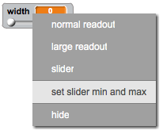

## Canvi de l'amplada del llapis

Permetem que l'usuari dibuixi amb un rang de diferents mides de llapis.

+ Primer, afegiu una nova variable anomenada `amplada`{: class = "blockvariable"}.

[[[generic-scratch-add-variable]]]

+ Afegiu aquesta línia *dins de l'* el `per sempre`{: class = "blockcontrol"} loop del codi del llapis:

```blocks
    estableix la mida de la ploma a (ample)
```

L'amplada del llapis s'establirà repetidament al valor de la variable "amplada".

+ Feu clic amb el botó dret a la visualització de la variable a l'escenari i feu clic a "control lliscant".


Ara podeu arrossegar el control lliscant per sota de la variable per canviar el seu valor.


+ Proveu el vostre projecte i vegeu si podeu modificar l'amplada del llapis.


Si ho preferiu, podeu establir el valor mínim i màxim de "amplada" que està permès. Per fer-ho, feu clic amb el botó dret a la variable de nou i feu clic a "Configura el control lliscant mínim i màxim". Establiu els valors mínims i màxims de la variable a una cosa més sensible, com ara l'1 i la 20.



Continueu provant la vostra variable "ample" fins que estigueu contents.