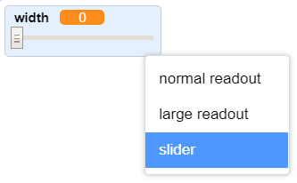

## Canvieu l'amplada del llapis

A continuació, s’afegirà un codi per permetre a la persona que utilitza el vostre programa dibuixar coses amb diferents amplades de llapis.

\--- task \--- Primer, afegiu una nova variable anomenada `width`{: class = "block3variables"}.

[[[generic-scratch3-add-variable]]] \--- / tasca \---

\--- task \--- Afegiu aquesta línia **dins de** al `forever`{: class = "block3control"} bucle del codi sprite del llapis:

```blocks3
quan es fa clic a la bandera
esborrar tots els
vestit de canvi a (llapis blau v)
establir el color del llapis a [# 0035FF]
per sempre
anar a (punter del ratolí v)
+ establir la mida del llapis a (ample :: variables)
si <<mouse down?> i <(ratolí i) > [-120]>> i 
  penals a
  més,
  penals fins al final

```

\--- /task \---

L’amplada del llapis ara es repeteix repetidament en el valor de la variable `width`{: class = "block3variables"}.

\--- \--- tasca Feu clic dret a l' `ample de`{: class = "block3variables"} variable que es mostra a l'escenari i, a continuació, feu clic a **lliscant**.

 \--- /task \---

Ara podeu arrossegar el botó lliscant visible sota de la variable per canviar el valor de la variable.


\--- task \--- Poseu a prova el vostre projecte i vegeu si podeu afegir codi per ajustar l’amplada del llapis.

 \--- /task \---