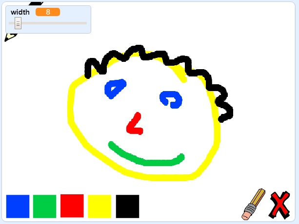

--- no-print ---

Dyma'r fersiwn **Scratch 3** y prosiect. Mae yna hefyd fersiwn [Scratch 2 y prosiect](https://projects.raspberrypi.org/cy-GB/projects/paint-box-scratch2).

--- /no-print ---

## Cyflwyniad

Gwna dy raglen peintio dy hunan!

### Yr hyn byddi di'n ei greu

--- no-print --- Clicia'r faner werdd i gychwyn. Defnyddia'r llygoden i symud y pensil, a dal y botwm chwith ar y llygoden i dynnu llun. Clicia lliw i newid pensiliau. Clicia'r dileuwr i newid iddo, a'i ddefnyddio i ddileu dy waith. I glirio'r dudalen, clicia'r groes.

  <iframe allowtransparency="true" width="485" height="402" src="//scratch.mit.edu/projects/embed/327353013/?autostart=false" frameborder="0" scrolling="no"></iframe>
  

--- /no-print ---

--- print-only --- Fe fyddi di'n clicio'r faner werdd i gychwyn, yna'n defnyddio'r llygoden i symud y pensil a dal botwm chwith y llygoden i dynnu llun. Bydd clicio ar liw yn newid lliw y pensil, a clicio ar y dileuwr yn newid i'r dileuwr!

 --- /print-only ---

--- collapse ---
---
title: Yr hyn byddi di'n ei ddysgu
---
+ Ychwanegwch yr estyniad pin yn Scratch
+ Defnyddiwch ddarllediadau i reoli’r ciplun yn Scratch
+ Ail-arddangoswch sut i ymateb i ddigwyddiadau llygoden yn Scratch
--- /collapse ---
--- collapse ---
---
title: Beth fydd ei angen arno ti
---
### Caledwedd

+ Cyfrifiadur sy'n gallu rhedeg Scratch 3

### Meddalwedd

+ Scratch 3 (unai [arlein](https://rpf.io/scratchon){:target="_blank"} neu [all-lein](https://rpf.io/scratchoff){:target="_blank"})

### Lawrlwythiadau

+ [ Prosiect cychwyn all-lein ](https://rpf.io/p/cy-GB/paint-box-go){:target="_blank"}

--- /collapse ---

--- collapse ---
---
title: Gwybodaeth ychwanegol i addysgwyr
---
Os oes angen i chi argraffu y prosiect, defnyddiwch [fersiwn i'w argraffu](https://projects.raspberrypi.org/cy-GB/projects/paint-box/print){:target="_blank"}.

Gallwch chi ddod o hyd i'r [ateb ar gyfer y prosiect hwn yma](https://rpf.io/p/cy-GB/paint-box-get){:target="_blank"}. --- /collapse ---