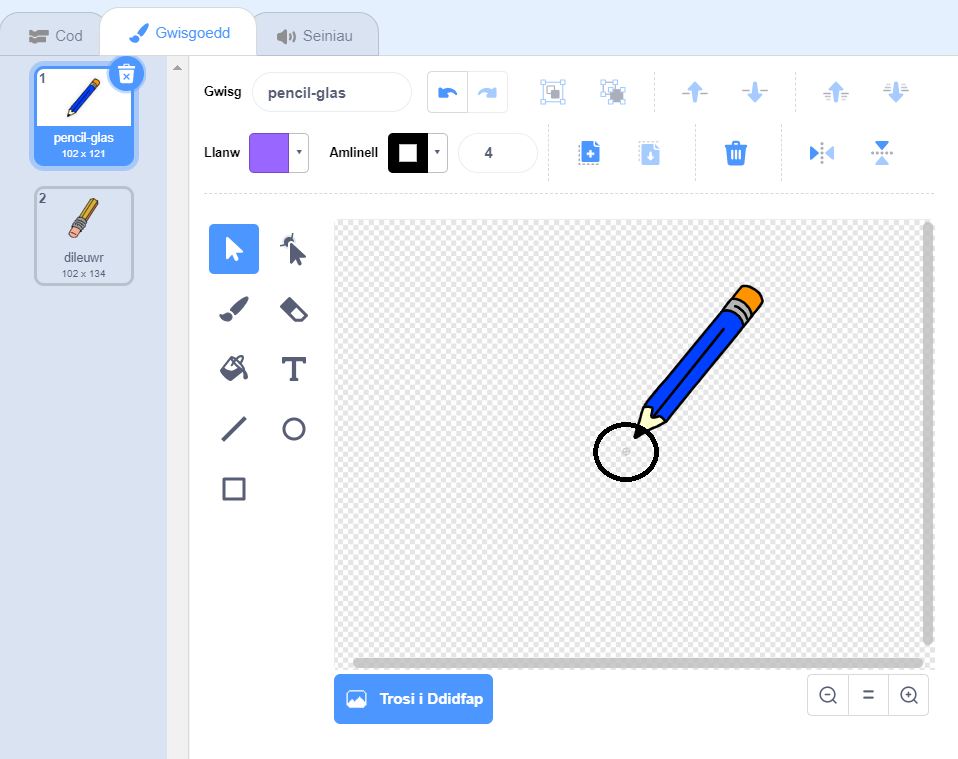

## Creu pensil

Fe wnawn ni ddechrau trwy greu pensil mae modd ei ddefnyddio i arlunio ar y llwyfan.

\--- task \--- Agora prosiect cychwynol 'Bocs Paentio'.

**Arlein:** agora brosiect Scratch newydd yma [rpf.io/paint-box-on](http://rpf.io/paint-box-on){:target="_blank"}

Os oes ganddot ti gyfrif Scratch galli di wneud copi drwy glicio ar **Remix**.

**All-lein**: agor y [prosiect cychwynnol](http://rpf.io/p/en/paint-box-go) {: target = "_ wag"} yn y golygydd all-lein.

Os oes angen i ti lawrlwytho a gosod golygydd Scratch all-lein, mae modd dod o hyd iddo yma [rpf.io/scratchoff](http://rpf.io/scratchoff){:target="_blank"}

Yn y prosiect cychwynnol, fe ddylet ti weld corlun pensil a dileuwr:

 \--- /task \---

\--- task \---

Ychwanega'r estyniad Pin i dy brosiect.

[[[generic-scratch3-add-pen-extension]]]

\--- /task \---

\--- task \---

Ychwanega gôd i gorlun dy bensil i wneud i'r corlun ddilyn y llygoden `am byth`{:class="block3control"} fel dy fod yn gallu tynnu llun:


```blocks3
pan fo'r flag werdd yn cael ei glicio
am byth 
  mynd i (pwyntydd llygoden v)
end
```

\--- /task \---

\--- task \--- Clicia'r faner a symud y llygoden o gwmpas y Llwyfan i brofi os yw dy gôd yn gweithio. \--- /task \---

Gwna dy bensil i dynnu llun `os`{:class="block3control"} yw'r llygoden yn cael ei chlicio.

\--- task \--- Ychwanega'r côd yma i gorlun dy bensil:


```blocks3
pan fo'r flag werdd yn cael ei glicio
am byth 
  mynd i (pwyntydd llygoden v)

  + os <llygoden i lawr?> yna 
     pin i lawr
     fel arall 
      pin i fyny
    end
end
```

\--- /task \---

\--- task \--- Profa dy gôd eto. Y tro hwn, symud y pensil o gwmpas y Llwyfan a dal botwm y llygoden. Wyt ti'n gallu tynnu llun gyda dy bensil?

 \--- /task \---

## \---collapse\---

## title: Ydy dy bensil yn tynnu llun o flaen y pensil?

Os yw'r llinell mae dy bensil yn tynnu yn edrych fel ei fod yn dod o ganol y pensil, mae angen iti newid corlun y pensil fel mai'r blaen yw canol dy gorlun.

Clicia corlun dy bensil yna clicia tab **Gwisgoedd**.

Symuda'r wisg fel fod blaen y pensil **uwchben** y canol.



Symuda'r pensil o gwmpas y Llwyfan i dynnu llun. Fe ddylai'r pensil nawr dynnu llun o'i flaen.

\--- /collapse \---