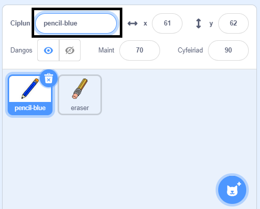
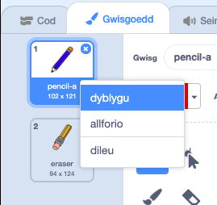
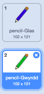

## Pensiliau lliw

Awn ati i ychwanegu pensiliau lliw gwahanol i dy brosiect, a gadael i’r defnyddiwr ddewis rhyngddyn nhw.

\--- task \--- Rename the `pencil` sprite to `pencil-blue`

 \--- /task \---

\--- task \--- Right click on the pencil sprite, and duplicate the 'pencil-blue' costume.

 \--- /task \---

\--- task \--- Ail-enwa dy wisg newydd yn ‘pensil-gwyrdd’, a lliwia’r pensil yn wyrdd.



\--- /task \---

\--- task \--- Tynna lun o ddau gorlun newydd: un sgwâr glas ac un sgwâr gwyrdd. Mae'r rhain ar gyfer dewis rhwng y pensil glas a gwyrdd.

 \--- /task \---

\--- task \--- Ail-enwi'r corluniau newydd fel eu bod yn cael eu galw'n 'glas' a 'gwyrdd'

[[[generic-scratch3-rename-sprite]]]

\--- /task \---

\--- task \--- Ychwanega gôd i dy gorlun 'gwyrdd' fel ei fod yn `darlledu`{:class="block3events"} y neges "gwyrdd" pan mae'n cael ei glicio.


```blocks3
pan gaiff y ciplun yma ei glicio
darlledu (gwyrdd v)
```

[[[generic-scratch3-broadcast-message]]] \--- /task \---

Fe ddylai'r corlun pensil wrando ar y neges "gwyrdd" a newid ei wisg a lliw mewn ymateb.

\--- task \--- Newida i dy gorlun pensil. Ychwanega gôd sy'n golygu pan mae'r corlun yn derbyn darllediad `gwyrdd`{:class="block3events"}, mae'n newid i wisg werdd a newid lliw y pensil i wyrdd.


```blocks3
pan rwy'n derbyn [gwyrdd v]
newid gwisg i (pencil-gwyrdd v)
gosod lliw pin i [#00CC44]
```

I newid lliw y pensil i wyrdd, clicia'r sgwâr wedi lliwio yn y bloc `gosod lliw pin`{:class="block3extensions"}, yna chlicio ar y corlun gwyrdd sgwâr. \--- /task \---

Yna gwna'r un peth fel dy fod yn gallu newid lliw dy bensil i las.

\--- task \--- Clicia ar y corlun sgwâr glas ac ychwanegu'r côd yma:


```blocks3
pan gaiff y ciplun yma ei glicio
darlledu (glas v)
```

Yna clicia ar gorlun y pensil ac ychwanegu'r côd yma: 

```blocks3
pan rwy'n derbyn [glas v]
newid gwisg i (pencil-glas v)
gosod lliw pin i [#0000ff]
```

\--- /task \---

\--- task \--- Yn olaf, ychwanega'r côd yma i ddweud wrth y corlun pensil pa liw i ddechrau gyda, ac i sicrhau fod y sgrin yn glir pan wyt ti'n cychwyn y rhaglen.


```blocks3
pan fo'r flag werdd yn cael ei glicio
+dileu popeth
+newid gwisg i (pencil-glas v)
+gosod lliw pin i [#0035FF]
am byth 
  mynd i (pwyntydd llygoden v)
  os <llygoden i lawr?> yna 
    pin i lawr
  fel arall 
    pin i fyny
  end
end
```

\--- /task \---

Os oes well gyda ti, mae modd i ti ddechrau gyda lliw pensil gwahanol.

\--- task \--- Profa dy gôd. Wyt ti'n gallu newid rhwng y lliwiau pensil gwyrdd a glas trwy glicio ar y gorluniau sgwâr gwyrdd neu glas?

 \--- /task \---