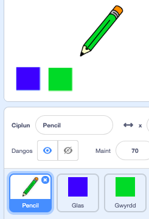

## Pensiliau lliw

Awn ati i ychwanegu pensiliau lliw gwahanol i dy brosiect, a gadael i’r defnyddiwr ddewis rhyngddyn nhw.

--- task --- Ailenwch y `pencil` i `pencil-blue`

 --- /task ---

--- task --- Cliciwch dde ar guplun y pensil, a dyblygu gwisg 'pencil-blue'.

 --- /task ---

--- task --- Ail-enwa dy wisg newydd yn ‘pensil-gwyrdd’, a lliwia’r pensil yn wyrdd.


--- /task ---

--- task --- Tynna lun o ddau gorlun newydd: un sgwâr glas ac un sgwâr gwyrdd. Mae'r rhain ar gyfer dewis rhwng y pensil glas a gwyrdd.

 --- /task ---

--- task --- Ail-enwi'r corluniau newydd fel eu bod yn cael eu galw'n 'glas' a 'gwyrdd'

[[[generic-scratch3-rename-sprite]]]

--- /task ---

--- task --- Ychwanega gôd i dy gorlun 'gwyrdd' fel ei fod yn `darlledu`{:class="block3events"} y neges "gwyrdd" pan mae'n cael ei glicio.


```blocks3
when this sprite clicked
broadcast (gwyrdd v)
```

[[[generic-scratch3-broadcast-message]]] --- /task ---

Fe ddylai'r corlun pensil wrando ar y neges "gwyrdd" a newid ei wisg a lliw mewn ymateb.

--- task --- Newida i dy gorlun pensil. Ychwanega gôd sy'n golygu pan mae'r corlun yn derbyn darllediad `gwyrdd`{:class="block3events"}, mae'n newid i wisg werdd a newid lliw y pensil i wyrdd.


```blocks3
when I receive [gwyrdd v]
switch costume to (pencil-gwyrdd v)
set pen color to [#00CC44]
```

I newid lliw y pensil i wyrdd, clicia'r sgwâr wedi lliwio yn y bloc `gosod lliw pin`{:class="block3extensions"}, yna chlicio ar y corlun gwyrdd sgwâr. --- /task ---

Yna gwna'r un peth fel dy fod yn gallu newid lliw dy bensil i las.

--- task --- Clicia ar y corlun sgwâr glas ac ychwanegu'r côd yma:


```blocks3
when this sprite clicked
broadcast (glas v)
```

Yna clicia ar gorlun y pensil ac ychwanegu'r côd yma: 

```blocks3
when I receive [glas v]
switch costume to (pencil-glas v)
set pen color to [#0000ff]
```

--- /task ---

--- task --- Yn olaf, ychwanega'r côd yma i ddweud wrth y corlun pensil pa liw i ddechrau gyda, ac i sicrhau fod y sgrin yn glir pan wyt ti'n cychwyn y rhaglen.


```blocks3
when flag clicked
+erase all
+switch costume to (pencil-glas v)
+set pen color to [#0035FF]
forever
  go to (pwyntydd llygoden v)
if <mouse down?> then
  pen down
  else
  pen up
end
```

--- /task ---

Os oes well gyda ti, mae modd i ti ddechrau gyda lliw pensil gwahanol.

--- task --- Profa dy gôd. Wyt ti'n gallu newid rhwng y lliwiau pensil gwyrdd a glas trwy glicio ar y gorluniau sgwâr gwyrdd neu glas?

 --- /task ---