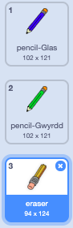

## Dadwneud camgymeriadau

Weithiau mae camgymeriadau'n digwydd, felly ychwanega fotwm 'clirio' a botwm dileuwr.

--- task --- Ychwanega'r corlun 'X-block' o adran llythrennau'r llyfrgell. Lliwia gwisg y corlun yn goch a'i wneud ychywig yn llai. Y corlun yma yw'r botwm 'clirio'.

[[[generic-scratch3-sprite-from-library]]]

 --- /task ---

--- task --- Ychwanega gôd i gorlun 'X-block' i glirio'r Llwyfan pan mae'r corlun yn cael ei glicio.


```blocks3
pan gaiff y ciplun yma ei glicio
dileu popeth
```

--- /task ---

Does dim angen defnyddio `darlledu`{:class="block3events"} i glirio'r Llwyfan, gan fod y bloc `dileu popeth`{:class="block3extensions"} yn gwneud hynny.

Wyt ti'n gweld fod y corlun pensil yn cynnwys gwisg dileuwr?



Mae dy brosiect hefyd yn cynnwys corlun dileuwr ar wahân.

--- task --- Gwna clic-dde ar gorlun y dileuwr a chlicia **dangos**. Dyma sut y dylai dy Lwyfan ymddangos nawr:

 --- /task ---

--- task --- Ychwanega gôd i gorlun y dileuwr i anfon `darllediad 'dileuwr'`{:class="block3events"} pan mae'r dileuwr yn cael ei glicio.


```blocks3
pan gaiff y ciplun yma ei glicio
darlledu (dileuwr v)
```

--- /task ---

Pan fo'r corlun pensil yn derbyn neges 'dileuwr', fe ddylai newid gwisg i'r dileuwr a newid lliw y pen i wyn, sef yr un lliw â'r Llwyfan!

--- task --- Ychwanega gôd i greu dileuwr.

--- hints ---
 --- hint --- Ychwanegwch gôd i’r guplun y pensil: `Pan rwy'n derbyn`{:class="block3events"} neges `dileuwr`{:class="block3events"} `Newid gwisg i dileuwr`{:class="block3looks"} `Gosod y pin`{:class="block3extensions"} i wyn
--- /hint ---
 --- hint --- Dyma’r holl flociau byddwch angen:

```blocks3
gosod lliw pin i [#FFFFFF]

pan rwy'n derbyn [dileuwr v]

newid gwisg i (dileuwr v)
```

--- /hint --- --- hint --- Dyma sut dylai dy gôd edrych: 

```blocks3
pan rwy'n derbyn [dileuwr v]
newid gwisg i (dileuwr v)
gosod lliw pin i [#FFFFFF]
```

--- /hint --- --- /hints --- --- /task ---

--- task --- Profa dy brosiect i weld os wyt ti'n gallu clirio'r Llwyfan a dileu'r llinellau pensil.

 --- /task ---

Mae un problem arall gyda'r pensil: rwyt ti'n gallu tynnu llun unrhywle ar y Llwyfan, gan gynnwys ger y botymau 'clirio' a dileuwr!


--- task --- I ddatrys hyn, mae angen i ti ddweud wrth y pensil i dynnu llun os yw’r llygoden wedi clicio **ac** os yw `y-position` y llygoden yn fwy na `-120`:


```blocks3
pan fo'r flag werdd yn cael ei glicio
dileu popeth
newid gwisg i (pencil-glas v)
gosod lliw pin i [#0035FF]
am byth 
  mynd i (mouse pointer v)
  + os <<llygoden i lawr?> a <(llygoden y) > [-120]>> yna 
      pin i lawr
    fel arall 
      pin i fyny
    end
end
```

--- /task ---

--- task --- Profa dy brosiect. Ni ddylet ti nawr allu tynnu llun ger y botymau.

 --- /task ---