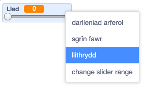
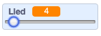

## Newid lled y pensil

Rwyt ti nawr am ychwanegu côd i ganiatâu'r defnyddiwr i dynnu llun yn defnyddio amrywiaeth o feintiau pensiliau gwahanol.

--- task --- Yn gyntaf, ychwanega newidyn newydd o'r enw `lled`{:class="block3variables"}.

[[[generic-scratch3-add-variable]]] --- /task ---

--- task --- Ychwanega'r llinell hon **tu fewn** dolen `am byth`{:class="block3control"} côd corlun y pensil:

```blocks3
pan fo'r flag werdd yn cael ei glicio
dileu popeth
newid gwisg i (pencil-glas v)
gosod lliw pin i [#0035FF]
am byth 
  mynd i (pwyntydd llygoden v)
  + gosod maint pin i (lled :: variables)
  os <<llygoden i lawr?> a < (llygoden y) > [-120]>> yna 
    pin i lawr
  fel arall 
    pin i fyny
  end
end
```

--- /task ---

Mae lled dy bensil nawr yn cael ei osod i gyfanswm `lled`{:class="block3variables"} y newidyn.

--- task --- Gwna clic dde ar newidyn `lled`{:class="block3variables"} sy'n ymddangos ar y Llwyfan, yna clicia'r **llithrydd**.

 --- /task ---

Galli di nawr lusgo’r llithrydd o dan y newidyn i newid ei werth.



--- task --- Profa dy brosiect a gweld os wyt ti'n gallu ychwanegu côd i newid lled y pen.

 --- /task ---