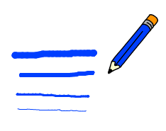

## Newid lled y pensil

Rwyt ti nawr am ychwanegu côd i ganiatâu'r defnyddiwr i dynnu llun yn defnyddio amrywiaeth o feintiau pensiliau gwahanol.

\--- task \---

First, add a new variable called `width`{:class="block3variables"}.

[[[generic-scratch3-add-variable]]]

\--- /task \---

\--- task \---

Add this line **inside** the `forever`{:class="block3control"} loop of the pencil sprite's code:

```blocks3
pan fo'r flag werdd yn cael ei glicio
dileu popeth
newid gwisg i (pencil-glas v)
gosod lliw pin i [#0035FF]
am byth 
  mynd i (pwyntydd llygoden v)
  + gosod maint pin i (lled :: variables)
  os <<llygoden i lawr?> a < (llygoden y) > [-120]>> yna 
    pin i lawr
  fel arall 
    pin i fyny
  end
end
```

\--- /task \---

The pen width now repeatedly gets set to the value of the `width`{:class="block3variables"} variable.

\--- task \---

Right-click on the `width`{:class="block3variables"} variable displayed on the Stage, and then click on **slider**.


\--- /task \---

You can now drag the slider that is visible below the variable to change the variable's value.


\--- task \---

Test your project and see if you can add code to adjust the pen width.



\--- /task \---