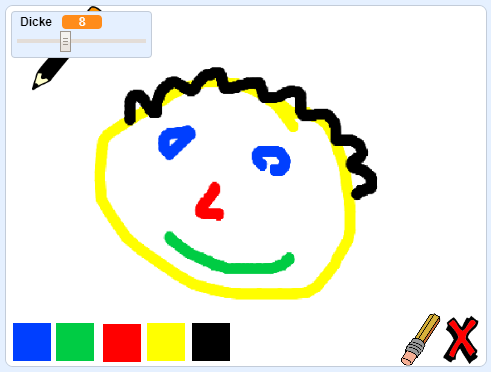

\--- no-print \---

Dies ist die **Scratch 3** Version des Projekts. Es gibt auch eine [Scratch 2 Version des Projekts](https://projects.raspberrypi.org/en/projects/paint-box-scratch2).

\--- /no-print \---

## Einleitung

Mach dein eigenes Malprogramm!

### Was du machen wirst

\--- no-print \---

Click on the green flag to start. Use the mouse to move the pencil, and hold down the left mouse button to draw. Click on a colour to change pencils. Click on the eraser to change to it, and use it to erase your work. To clear the page, click on the cross.

  <iframe allowtransparency="true" width="485" height="402" src="//scratch.mit.edu/projects/embed/267243161/?autostart=false" frameborder="0" scrolling="no"></iframe>
  

\--- /no-print \---

\--- print-only \---

You will click on the green flag to start, and you'll use the mouse to move the pencil and hold down the left mouse button to draw. Clicking on a colour will change pencil colours, and clicking on the eraser will change to the eraser!

\--- /print-only \---

## \--- collapse \---

## title: Was du lernen wirst

+ Hinzufügen der Erweiterung Malstift zu deinem Scratch
+ Verwendung von Broadcast, um eine Figur in Scratch zu steuern
+ Recall how to respond to mouse events in Scratch

\--- /collapse \---

## \--- collapse \---

## title: Was du brauchen wirst

### Hardware

+ Ein Computer, auf dem Scratch 3 ausgeführt werden kann

### Software

+ Scratch 3 (entweder [online](http://rpf.io/scratchon){:target="_blank"} oder [offline](http://rpf.io/scratchoff){:target="_blank"})

### Downloads

+ [Offline Starter Projekt](http://rpf.io/p/en/paint-box-go){:target="_blank"}

\--- /collapse \---

## \--- collapse \---

## title: Zusätzliche Informationen für Pädagogen

If you need to print this project, please use the [printer-friendly version](https://projects.raspberrypi.org/en/projects/paint-box/print){:target="_blank"}.

You can find the [completed project here](http://rpf.io/p/en/paint-box-get){:target="_blank"}.

\--- /collapse \---