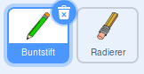
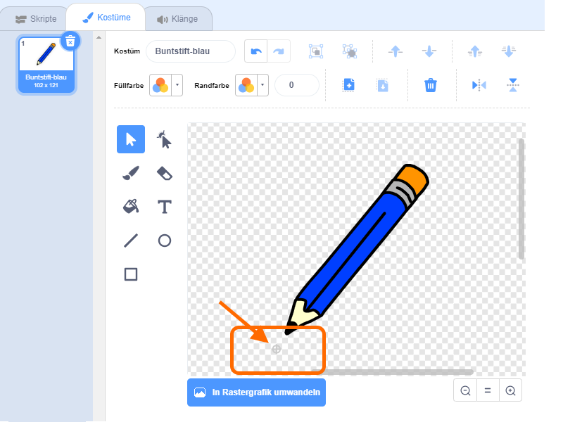

## Was du brauchen wirst

Beginnen wir mit einem Buntstift, mit dem wir auf der Bühne zeichnen können.

\--- task \--- Öffne das Scratch 'Malkasten' Projekt.

**Online:** Öffne das Projekt zum Starten [rpf.io/paint-box-on](http://rpf.io/paint-box-on){:target="_blank"}

Wenn du bereits einen Scratch-Account besitzt, kannst du dir durch klicken auf **Remix** eine Kopie erstellen.

**Offline**: Öffne das [Start-Projekt](http://rpf.io/p/en/paint-box-go){:target="_blank"} im Offline-Editor.

Wenn du Scratch herunterladen und auf deinem Rechner installieren möchtest, findest du es unter diesem Link: [rpf.io/scratchoff](http://rpf.io/scratchoff){:target="_blank"}

Im Start-Projekt solltest du eine Buntstift- und eine Radierer-Figur sehen:

 \--- /task \---

\--- task \---

Füge die Erweiterung Malstift deinem Projekt hinzu.

[[[generic-scratch3-add-pen-extension]]]

\--- /task \---

\--- task \---

Füge dem Stift folgenden Code hinzu, damit er der Maus `wiederhole fortlaufend`{:class="blockcontrol"} folgt und du mit ihm malen kannst:


```blocks3
when flag clicked
forever
  go to (mouse pointer v)
end
```

\--- /task \---

\--- task \--- Klicke auf die Flagge und bewege die Maus über die Bühne. Sieh, ob der Code richtig arbeitet. \--- /task \---

Als nächstes versuchen wir den Stift nur dann zeichnen zu lassen, `falls`{:class="blockcontrol"} die Maustaste gedrückt wird.

\--- task \--- Füge deiner Buntstift-Figur diesen Code hinzu:


```blocks3
when flag clicked
forever
  go to (mouse pointer v)

+ if <mouse down?> then
  pen down
  else
  pen up
end
```

\--- /task \---

\--- task \--- Test erneut deinen Code. Halte diesmal die Maustaste gedrückt, wenn du die Maus über die Bühne bewegst. Kannst du mit deinem Stift zeichnen?

 \--- /task \---

## \--- collapse \---

## title: Zeichnet dein Buntstift nicht mit der Spitze?

Wenn dein Buntstift nicht mit der Spitze zu zeichnen scheint, sondern mit der Mitte, musst du den Buntstift im Kostüm verschieben.

Klicke auf dei Buntstift-Figur und anschließend auf den **Kostüme** Reiter.

Bewege das Kostüm so, dass die Spitze des Buntstifts **knapp unter** dem Zentrum liegt.



Bewege nun den Buntstift auf der Bühne und zeichne. Der Buntstift sollte jetzt eine Linie von seiner Spitze aus zeichnen.

\--- /collapse \---