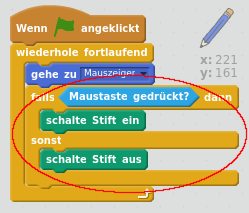

## Einen Bleistift entwerfen

Lass uns damit starten, dass wir einen Bleistift entwerfen, mit dem man auf der Bühne zeichnen kann.

+ Starte ein neues Scratch-Projekt und lösche die Katzenfigur, so dass Dein Projekt leer ist. Du findest das Scratch-Bearbeitungsprogramm online auf <a href="http://jumpto.cc/scratch-new">jumpto.cc/scratch-new</a>.

+ Füge Deinem Projekt diese Bleistift-Figur hinzu:

	

+ Klicke auf 'Kostüm' und lösche das 'Bleistift-b'-Kostüm.

	

+ Benenne Dein Kostüm in 'Bleistift-blau' um und benutze das 'Eine Kontur einfärben'-Werkzeug, um das Kostüm blau einzufärben.

	

+ Da Du die Maus zum Zeichnen benutzen wirst, möchtest Du, dass der Stift immer bzw. `wiederhole fortlaufend`{:class="blockcontrol"} der Maus folgt. Füge Deiner Bleistift-Figur diesen Code hinzu:

	```blocks
      Wenn die grüne Flagge angeklickt
      wiederhole fortlaufend
       gehe zu [Mausanzeiger v]
      Ende
	```

+ Teste den Code, indem Du auf die Fahne klickst und die Maus auf der Bühne hin und her bewegst. Funktioniert es so, wie Du es Dir vorgestellt hast?

+ Hast Du bemerkt, dass es die Mitte des Bleistifts und nicht die Spitze ist, die der Mausbewegung folgt?

	

	Um dies zu ändern, klicke auf das 'Bleistift-blau'-Kostüm Deiner Bleistift-Figur und dann auf das 'Drehpunkt des Kostüms'-Symbol.

	

+ Du solltest feststellen, dass ein Kreuz erscheint. Du kannst nun knapp unter die Spitze des Bleistiftes klicken, um diese Stelle als das Zentrum der Figur zu definieren (Achtung: Nicht direkt auf die Bleistiftspitze klicken, da der Bleistift so nicht korrekt zeichnen wird).

	

+ Klicke auf den Skripte-Reiter und teste erneut Deinen Bleistift. Funktioniert es nun besser als zuvor?

+ Als nächstes, lass uns Deinen Bleistift zeichnen lassen, `wenn`{:class="blockcontrol"} die Maus geklickt wird. Füge diesen Code Deiner Bleistift-Figur hinzu:

	

+ Teste wieder Deinen Code. Bewege dieses Mal den Bleistift auf der Bühne, während Du die Maustaste gedrückt hältst. Kannst Du mit Deinem Bleistift malen?

	
	


