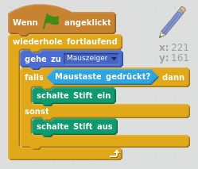

## Einen Stift machen

Beginnen wir mit einem Stift, mit dem wir auf der Bühne zeichnen können.

+ Öffne das 'Painbox'-Projekt in Scratch entweder online bei [jumpto.cc/paint-go](http://jumpto.cc/paint-go){:target="_blank"} oder lade es unter <http://jumpto.cc/paint-get>{:target="_blank"} herunter wenn du den Offline-Editor benutzt.

Bei den Figuren siehst du einen Stift und einen Radierer:


+ Füge dem Stift folgenden Code hinzu, damit er der Maus `ständig`{:class="blockcontrol"} folgt und du mit ihm malen kannst:

```blocks
    Wenn die grüne Flagge angeklickt
wiederhole fortlaufend 
  gehe zu [mouse pointer v]
end
```

+ Klicke auf die Flagge und bewege die Maus über die Bühne. Sieh, ob der Code richtig arbeitet.

Als nächstes versuchen wir, den Stift nur dann zeichnen zu lassen, `wenn`{:class="blockcontrol"} die Maus geklickt wird.

+ Füge diesen Code deiner Stift-Figur hinzu:



+ Teste deinen Code nochmals. Halte diesmal die Maustaste gedrückt, wenn du die Maus über die Bühne bewegst. Kannst du mit deinem Stift zeichnen?


## \--- collapse \---

## title: Wenn du Probleme hast...

Wenn dein Stift nicht mit der Spitze zu zeichnen scheint, sondern mit der Mitte, dann musst du die Kostüm-Mitte ändern.


Du musst das Fadenkreuz für den Stift **knapp unter** der Spitze des Stifts platzieren, nicht genau auf der Spitze.

Die Änderungen der Kostüm-Mitte einer Figurwerden erst wirksam, wenn etwas Anderes angeklickt wird. Klicke also auf ein anderes Kostüm oder auf den 'Skripte'-Reiter um deine Änderungen abzuschließen.

\--- /collapse \---