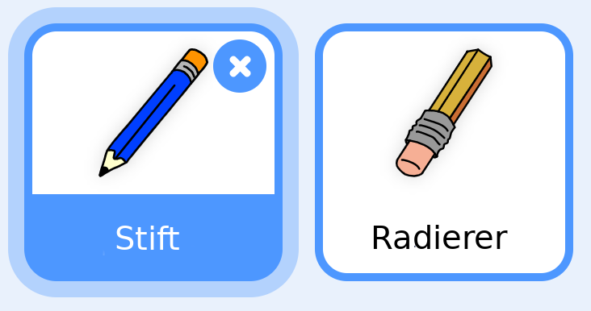

## Einen Stift machen

Beginnen wir mit einem Stift, mit dem wir auf der Bühne zeichnen können.

+ Scratch kann entweder online bei [jumpto.cc/paint-go{:target="_blank"}](http://jumpto.cc/paint-go) verwendet werden, oder unter [http://jumpto.cc/paint-get{:target="_blank"}](http://jumpto.cc/paint-get) heruntergeladen und offline benutzt werden.

Bei den Figuren siehst du einen Stift und einen Radierer:



+ Füge dem Stift folgenden Code hinzu, damit er der Maus `ständig`{:class="blockcontrol"} folgt:

```blocks
    when flag clicked
    forever
      go to [mouse pointer v]
    end
```

+ Klicke auf die Flagge und sieh, ob der Code richtig arbeitet.

Als nächstes versuchen wir, der Stift nur dann zeichnen zu lasse, `wenn`{:class="blockcontrol"} die Maus geklickt wird.

+ Füge diesen Code deiner Stift-Figur hinzu:


+ Teste deinen Code nochmals. This time, move the pencil around the stage and hold down the mouse button. Can you draw with your pencil?


## \--- collapse \---

## title: If you're having problems...

If your pencil seems to be drawing the line from the middle of the pencil rather than the tip, you will need to change your costume center.


The crosshair for the pencil must be placed **just below** the tip of the pencil, not on the tip of the pencil.

A changes in a sprite's 'costume center' isn't registered until another tab is clicked, so click on another costume, or on the 'Scripts' tab to finalise your changes to the costume center.

\--- /collapse \---