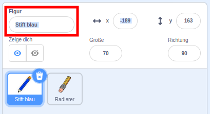

## Buntstifte

Laß uns deinem Projekt verschiedene Buntstifte hinzufügen, die der Anwender anschließend auswählen kann.

--- task ---

Ändere den Namen des `Buntstift-` Kostüms zu `Stift-blau`



--- /task ---

--- task ---

Klicke mit der rechten Maustaste im Reiter Kostüme auf das Stift-blau-Kostüm und dupliziere es.


--- /task ---

--- task ---

Ändere den Namen des neuen Kostüms in 'Stift-grün' und färbe den Buntstift grün.


--- /task ---

--- task ---

Zeichne zwei neue Figuren: ein blaues Quadrat und ein grünes Quadrat. Diese sind für die Auswahl einer Malfarbe für den dem blauen oder grünen Buntstift.


--- /task ---

--- task ---

Ändere den Namen der neuen Figuren, so dass diese 'blau' und 'grün' heißen

[[[generic-scratch3-rename-sprite]]]

--- /task ---

--- task ---

Füge nun Code zur ‘grün’-Figur hinzu, so dass sie, wenn sie geklickt wird, die Nachricht 'grün' `an alle sendet`{:class="block3events"}.


```blocks3
Wenn diese Figur angeklickt wird
sende (grün v) an alle
```

[[[generic-scratch3-broadcast-message]]]

--- /task ---

Die Buntstift-Figur soll auf die 'grün' Nachricht hören und seine Kostüm-Farbe und Buntstift-Farbe entsprechend ändern.

--- task ---

Schalte zu deiner Stift-Figur. Füge Code hinzu, so dass diese Figur, wenn sie die Nachricht `grün`{:class="block3events"} empfängt, zum Kostum Buntstift-grün wechselt und die Stiftfarbe zu grün ändert.


```blocks3
Wenn ich [grün v] empfange
wechsle zu Kostüm (Stift-grün v)
setze Stiftfarbe auf [#00CC44]
```

Um die Zeichenfarbe auf das gleiche Grün wie das Auswahlfeld zu setzen, klicke das farbige Feld in `setze Stiftfarbe auf`{:class="block3extensions"} an, und wähle die entsprechende Farbe aus.

--- /task ---

Nun kannst du das Gleiche machen, um den Buntstift auf blau zu schalten.

--- task ---

Klicke auf das blaue Quadrat und füge diesen Code hinzu:


```blocks3
Wenn diese Figur angeklickt wird
sende (blau v) an alle
```

Anschließend klicke auf die Buntstift-Figur und füge diesen Code hinzu:


```blocks3
Wenn ich [blau v] empfange
wechsle zu Kostüm (Stift-blau v)
setze Stiftfarbe auf [#0000ff]
```

--- /task ---

--- task ---

Zum Schluss fügst du noch Code ein, um der Bleistift Figur zu sagen mit welcher Farbe sei anfangen soll uns stell sicher, dass das Programm mit einem leeren Bildschirm beginnt.


```blocks3
Wenn die grüne Flagge angeklickt
+lösche alles
+wechsle zu Kostüm (Buntstift-blau v)
+setze Stiftfarbe auf [#0035FF]
wiederhole fortlaufend 
  gehe zu (Mauszeiger v)
falls <Maustaste gedrückt?> , dann 
  schalte Stift ein
  sonst 
  schalte Stift aus
end
```

--- /task ---

Wir haben hier blau gewählt, aber du kannst mit jeder anderen Stiftfarbe beginnen, wenn du willst.

--- task ---

Teste deinen Code. Kannst du zwischen den blauen und grünen Buntstiften wechseln, indem du das blaue bzw. grüne Quadrat anklickst?


--- /task ---