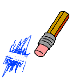

## Fehler machen

Manchmal passieren Fehler. Lass uns also unserem Projekt einen 'wische Malspuren weg'-Knopf hinzufügen!

+ Lass uns einen Knopf hinzufügen und die Bühne leeren. Um dies zu tun, füge die 'X-block'´-Buchstaben-Figur zu der Bühne hinzu und färbe sie rot.

	

+ Füge Deinem 'wische Malspuren weg'-Knopf diesen Code hinzu, damit die Bühne geleert wird, sobald dieser angeklickt wird:

	```blocks
      Wenn ich angeklickt werde
      wische Malspuren weg
	```

	Bemerke, dass Du keine Nachricht versenden musst, um die Bühne zu leeren, da jede Figur diese Fähigkeit besitzt.

+ Du kannst auch einen Radiergummi erstellen. Wenn der Club-Leiter euch einen 'Resources'-Ordner gegeben hat, klicke auf 'Figur aus einer Datei laden' und füge das 'eraser.svg'-Bild hinzu.

	

	Wenn Du das 'eraser.svg'-Bild nicht hast, erstelle stattdessen einfach einen neuen weißen Stift.

+ Du solltest das Radiergummi-Bild auch als eine neue Auswahl-Figur hinzufügen. So sollte Deine Bühne nun aussehen:

	

+ Du kannst die Radiergummi-Auswahl-Figur von 'eraser' zu 'Radiergummi' umbenennen, den Drehpunkt des Radiergummis kurz vor die Radiergummi-Spitze setzen (wie beim Bleistift) und dem Radiergummi diesen Code hinzufügen, um dem Stift mitzuteilen, zum Radiergummi zu wechseln:

	```blocks
  Wenn ich angeklickt werde
  sende [Radiergummi v] an alle
	```

+ Damit, sobald der Stift die Nachricht erhält, er zum Radiergummi wechselt und die Stiftfarbe ändert, füge ihm diesen Code hinzu:

	```blocks
  Wenn ich [Radiergummi v] empfange
  wechsle zu Kostüm [Radiergummi v]
  setze Stiftfarbe auf [#FFFFFF]
	```

+ Teste Dein Projekt, um zu sehen, ob Du die Bühne leeren und radieren kannst.

	

+ Es gibt noch ein kleines Problem mit dem Sift: Du kannst überall auf der Bühne malen, auch neben den Auswahl-Symbolen.

	

	Um dieses Problem zu lösen, musst Du dem Stift sagen nur dann zu malen, wenn die Maus angeklickt wird _und_ wenn die y-Position der Maus größer als -110 (`Maus y-Position`{.blocksensing}`> -120` {.blockoperators}) ist. Ändere die `wenn` {.blockcontrol}-Aussage Deines Stifts zu:

	

+ Teste Dein Projekt. Es sollte nun nicht mehr möglich sein in unmittelbarer Nähe der Auswahl-Blöcke zu malen.

	


