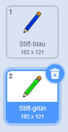

## Buntstifte

Laß uns deinem Projekt verschieden Buntstifte hinzufügen, und den Anwender aus ihnen auswählen.

+ Klicke auf deine Stift-Figur, dann auf Kostüme und dupliziere dein 'blaues Stift-Kostüm'.


+ Benenne dein neues Kostum um zu "Stift grün" und das alte zu "Stift blau".



[[[generic-scratch-rename-sprite]]]

+ Zeichne zwei neue Figuren - ein blaues und ein grünes Quadrat. Diese verwendest du um die Stiftfarbe umzuschalten.


+ Benenne die neuen Figuren 'blau' und 'grün'

+ Add some code to the 'green' sprite so that when it is clicked, it will `broadcast`{:class="blockevents"} the message "green" to the pencil sprite, telling it to change its costume and pencil colour.


[[[generic-scratch-broadcast-message]]]

+ Switch to your pencil sprite. Add some code so that when this sprite receives the `broadcast`{:class="blockevents"} green, it should switch to the green pencil costume and change the pen colour to green.


To set the pencil to colour to green, click the coloured box in the `set pen color`{:class="blockpen"} block, and click on the green sprite to choose the same colour green as your pencil colour.

+ You can now do the same for the blue pencil icon: add this code to the blue square sprite:

```blocks
when this sprite clicked
broadcast [blue v]
```

...and add this code to the pencil sprite:

```blocks
when I receive [blue v]
switch costume to [pencil-blue v]
set pen color to [#0000ff]
```

+ Finally, add this code to tell the pencil sprite which colour to start with, and make sure that the screen is clear.


We chose to start with blue but if you prefer, you can start with a different colour pencil.

+ Test out your project. Can you switch between blue and green pens by clicking on the blue or green square sprites?

