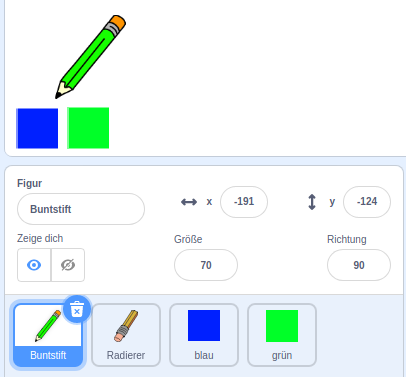
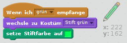

## Buntstifte

Laß uns deinem Projekt verschieden Buntstifte hinzufügen, und den Anwender aus ihnen auswählen.

+ Klicke auf deine Stift-Figur, dann auf Kostüme und dupliziere dein 'blaues Stift-Kostüm'.


+ Benenne dein neues Kostum um zu "Stift grün" und das alte zu "Stift blau".


[[[generic-scratch-rename-sprite]]]

+ Zeichne zwei neue Figuren - ein blaues und ein grünes Quadrat. Diese verwendest du um die Stiftfarbe umzuschalten.



+ Benenne die neuen Figuren 'blau' und 'grün'

+ Füge nun Code zur 'grün'-Figur hinzu so dasssie, wenn sie geklickt wird, die Nachricht "grün" `an alle schickt`{:class='blockevents':}. Dadurch ändert der Stift sein Kostüm und seine Farbe.


[[[generic-scratch-broadcast-message]]]

+ Schalte zu deiner Stift-Figur. Füge Code hinzu, so dass diese Figur, wenn sie die Nachricht "grün" `an alle`{:class='blockevents':} empfängt, zum grünen Stift-Kostüm wechselt und die Stiftfarbe zu grün ändert.



Um die Zeichenfarbe auf das gleiche Grün wie das Auswahlfeld zu setzen, klicke das farbige Kästchen in `setze Stiftfarbe auf`{:class='blockpen':} und klicke dann auf das grüne Quadrat.

+ Nun kannst du das gleiche für das blaue Symbol machen: füge diesen Coden zum blauen Quadrat:

```blocks
when this sprite clicked
broadcast [blue v]
```

...und diesen Code zur Stift-Figur:

```blocks
when I receive [blue v]
switch costume to [pencil-blue v]
set pen color to [#0000ff]
```

+ Finally, add this code to tell the pencil sprite which colour to start with, and make sure that the screen is clear.


We chose to start with blue but if you prefer, you can start with a different colour pencil.

+ Test out your project. Can you switch between blue and green pens by clicking on the blue or green square sprites?

