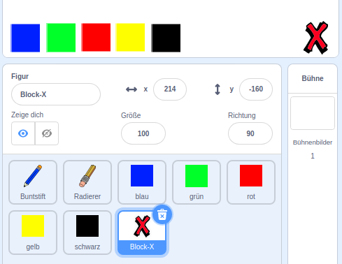
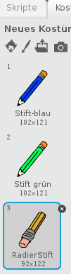
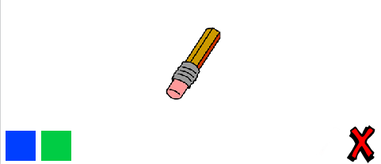

## Fehler machen

Manchmal passieren Fehler, lass uns also einen 'Löschen'-Knopf und einen Radierer hinzufügen.

\--- task \--- Füge die 'Block-X' Figur aus dem Buchstabenbereich der Sratch Bibliothek hinzu. Färbe das Kostüm rot ein und mache es etwas kleiner. Dieses Kostüm wird unser ‘Löschen’-Knopf.

[[[generic-scratch3-sprite-from-library]]]

 \--- /task \---

\--- task \--- Füge Code zur 'Block-X' Figur hinzu, um die Bühne zu löschen, wenn die Figur angeklickt wurde.


```blocks3
when this sprite clicked
erase all
```

\--- /task \---

Beachte, dass du gar keine `Nachricht senden`{:class="block3events"} musst um die Bühne zu löschen, es genügt der `lösche alles`{:class="block3extensions"} Block, der diese Aufgabe übernimmt.

Du hast vielleicht schon bemerkt, dass die Buntstift-Figur auch ein Radier-Kostüm enthält?



Dein Projekt enthält auch eine eigene Radier-Figur.

Klicke rechts auf diese Figur und wähle **zeige dich**. So sollte deine Bühne jetzt aussehen:

 \--- /task \---

\--- task \--- Füge der Radierer-Figur Code hinzu, um die Nachricht `'radierer' an alle zu senden`{:class="block3events"} wenn sie angeklickt wird.


```blocks3
when this sprite clicked
broadcast (radieren v)
```

\--- /task \---

Wenn der Buntstift die #radieren'-Nachricht empfängt, musst du das Buntstift-Kostüm zu “Radierer” ändern und die Buntstiftfarbe auf weiß ändern - die Farbe der Bühne!

\--- task \--- Füge Code hinzu, um den Radierer zu erstellen.

\--- hints \--- \--- hint \--- Füge der Buntstift-Figur folgenden Code hinzu: ` Wenn ich ` {: class = "block3events"} die Nachricht ` radieren ` {: class = "block3events"} empfange ` wechsle zu Kostüm ` {: class = "block3looks"} Radierer und ` setze Stiftfarbe auf ` {: class = "block3extensions"} weiß \--- / hint \--- \--- hint \--- Hier sind alle benötigten Blöcke:

```blocks3
set pen color to [#FFFFFF]
when I receive [radieren v]

switch costume to (Radierer v)
```

\--- /hint \--- \--- hint \--- So sollte dein Programmiercode aussehen: 

```blocks3
when I receive [radieren v]
switch costume to (Radierer v)
set pen color to [#FFFFFF]
```

\--- /hint \--- \--- /hints \--- \--- /task \---

\--- task \--- Teste dein Projekt und schau, ob du radieren kannst und die Bühne löschen.

 \--- /task \---

Es gibt noch ein Problem mit dem Buntstift - du kannst auf der ganzen Bühne zeichnen, auch im Bereich der Auswahlsymbole!


\--- Aufgabe \--- Um das zu beheben, änder den Code, damit der Stift nur dann unten ist, wenn die Maus angeklickt wird **und** die `y` Position des Mauszeigers größer ist als `-120` ist:


```blocks3
when flag clicked
erase all
switch costume to (Buntstift-blau v)
set pen color to [#0035FF]
forever
  go to (mouse pointer v)
+if <<mouse down?> and <(mouse y) > [-120]>> then 
  pen down
  else
  pen up
end
```

\--- /task \---

\--- task \--- Teste dein Projekt. Du solltest jetzt nicht mehr in der Nähe der Auswahlsymbole zeichnen können.

 \--- /task \---