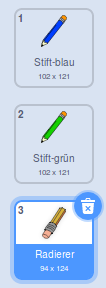

## Fehler ausbessern

Manchmal passieren Fehler, lass uns also einen 'Löschen'-Knopf und einen Radierer hinzufügen.

--- task ---

Füge die 'x-block' aus dem Buchstabenbereich der Bibliothek hinzu. Färbe das Kostüm rot ein und mache es etwas kleiner. Dieses Kostüm wird unser ‘Löschen’-Knopf.

[[[generic-scratch3-sprite-from-library]]]


--- /task ---

--- task ---

Füge Code zur 'Block-X' Figur hinzu, um die Bühne zu löschen, wenn die Figur angeklickt wurde.


```blocks3
when this sprite clicked
erase all
```

--- /task ---

Beachte, dass du gar keine `Nachricht an alle senden`{:class="block3events"} musst um die Bühne zu löschen, es genügt der `lösche alles`{:class="block3extensions"} Block, der diese Aufgabe übernimmt.

Du hast vielleicht schon bemerkt, dass die Buntstift-Figur auch ein Radier-Kostüm enthält?



Dein Projekt enthält auch eine eigene Radier-Figur.

--- task ---

Klicke mit der rechten Maustaste auf diese Radierer-Figur und klicke anschließend auf **zeigen**. So sollte deine Bühne jetzt aussehen:


--- /task ---

--- task ---

Füge der Radierer-Figur Code hinzu, um die Nachricht `'radieren' an alle senden`{:class="block3events"} wenn sie angeklickt wird.


```blocks3
when this sprite clicked
broadcast(radieren v)
```

--- /task ---

Wenn der Buntstift die 'radieren'-Nachricht empfängt, musst du das Buntstift-Kostüm zu “Radierer” ändern und die Buntstiftfarbe auf weiß ändern - die Farbe der Bühne!

--- task ---

Füge Code hinzu um den Radierer zu schaffen.

--- hints ---
 --- hint ---

Füge der Buntstift-Figur Code hinzu: `Wenn ich empfange`{:class="block3events"} die `radieren`{:class="block3events"} Nachricht `Wechsel zu Radierer Kostüm`{:class="block3looks"} `Setze Stiftfarbe auf`{:class="block3extensions"} weiß.

--- /hint --- --- hint ---

Hier sind alle Blöcke die du brauchst:

```blocks3
set pen color to [#FFFFFF]
when I receive [radieren v]

switch costume to  (Radierer v)
```

--- /hint --- --- hint ---

So sollte dein Code aussehen:


```blocks3
when I receive [radieren v]
switch costume to  (Radierer v)
set pen color to [#FFFFFF]
```

--- /hint ------ /hints --- --- /task ---

--- task ---

Teste dein Projekt und schau, ob du radieren kannst und die Bühne löschen.


--- /task ---

Es gibt noch ein Problem mit dem Buntstift - du kannst auf der ganzen Bühne zeichnen, auch im Bereich der Auswahlsymbole!


--- task ---

Um das zu beheben, ändere den Code, damit der Stift nur dann unten ist, wenn die Maus gedrückt wird **und** die `y` Position des Mauszeigers größer als `-120` ist:


```blocks3
when flag clicked
erase all
switch costume to (Stift-blau v)
set pen color to [#0035FF]
forever
  go to (Mauszeiger v)
+if <<mouse down?> and <(Maus y-Position) > [-120]>> then
  pen down
  else
  pen up
end
```

--- /task ---

--- task ---

Teste dein Projekt. Du solltest jetzt nicht mehr in der Nähe der Auswahlsymbole zeichnen können.


--- /task ---