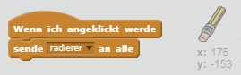

## Fehler machen

Manchmal passieren Fehler, lass uns also einen 'Löschen'-Knopf und einen Radiergummi hinzufügen.

+ Füge die 'X-block'-Figur hinzu - du findest sie in der Bibliothek, in der Kategorie Buchstaben. Färbe das Kostüm rot. Das wird der 'Löschen'-Knopf.


+ Füge Code zu dieser Figur hinzu, um die Bühne zu löschen, wenn sie geklickt wird.


Beachte, dass du gar keine Nachricht senden musst um die Bühne zu löschen, es genügt der Block "wische Malspuren weg" der Figur.

Du hast vielleicht schon bemerkt, dass die Stift-Figur auch ein Radier-Kostüm enthält:


+ Dein Projekt enthält auch eine eigene Radier-Figur. Klicke rechts auf diese Figur und wähle 'zeige dich'. Du kannst die Figur auch zu 'Radierer' umbenennen. So sollte deine Bühne jetzt aussehen:


+ Füge der Radierer-Figur Code hinzu, um den Stift auf radieren umzuschalten.



When the pencil receives the "eraser" message, you can switch the pencil costume to the eraser, and switch the pencil colour to white - the same colour as the stage!

+ Add some code to create the eraser

\--- hints \--- \--- hint \--- Add some code to the pencil sprite: **When I receive** the **eraser** message **Switch to costume** eraser **Set pen color** to white \--- /hint \--- \--- hint \--- Here is how the code inside the pencil sprite should look:

```blocks
when I receive [eraser v]
switch costume to [eraser v]
set pen color to [#FFFFFF]
```

\--- /hint \--- \--- /hints \---

+ Test your project, to see if you can clear and erase on the stage.


There's one more problem with the pencil - you can draw anywhere on the stage, including near the selector icons!


To fix this, tell the pencil only to draw if the mouse is clicked *and* if the y-position of the mouse is greater than -120:


+ Test your project; you now shouldn't be able to draw near the selector blocks.

