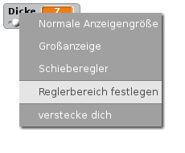

## Stiftbreite ändern

Geben wir dem Anwender die Möglichkeit verschieden dicke Stifte zu benutzen.

+ Füge zuerst eine neue Variable namens `Dicke`{:class='blockvariable':} hinzu.

[[[generic-scratch-add-variable]]]

+ Füge diese Zeile *innerhalb* der `wiederhole fortlaufend`{:class='blockcontrol':} Schleife ein:

```blocks
    set pen size to (Dicke)
```

Die Stift-Dicke wird nun immer wieder auf den Wert der 'Dicke'-Variablen gesetzt.

+ Klicke auf die Variablen-Anzeige auf der Bühne und klicke auf 'Schieberegler'.


Jetzt kannst du den Schieberegler unter der Variablen ziehen, um den Wert zu verändern.


+ Test your project, and see if you can modify the pencil width.


If you prefer, you can set the minimum and maximum value of 'width' that's allowed. To do this, right-click on the variable again and click 'set slider min and max'. Set the minimum and maximum values of your variable to something more sensible, like 1 and 20.



Keep testing your 'width' variable until you're happy.