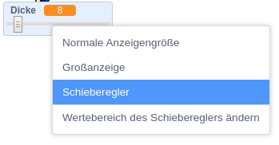
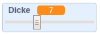

## Die Stiftdicke ändern

Als nächstes fügst du Code hinzu, um dem Amwender die Möglichkeit zu geben, mit verschiedenen Stiftdicken zu malen.

\--- task \---

Füge zuerst eine neue Variable namens `Dicke`{:class='blockvariable':} hinzu.

[[[generic-scratch3-add-variable]]]

\--- /task \---

\--- task \---

Füge diese Zeile **innerhalb** der `wiederhole fortlaufend`{:class='blockcontrol':} Schleife vom Buntstift ein:

```blocks3
when flag clicked
erase all
switch costume to (Buntstift-blau v)
set pen color to [#0035FF]
forever
go to (mouse pointer v)
+set pen size to (Dicke :: variables)
if <<mouse down?> and <(mouse y) > [-120]>> then 
  pen down
  else
  pen up
end
```

\--- /task \---

Die Stift-Dicke wird nun immer auf den Wert der Variablen `Dicke` {: class = "block3variables"} gesetzt.

\--- task \---

Klicke mit der rechten Maustaste auf die Variablen-Anzeige `Dicke`{:class="block3variables"} auf der Bühne und anschließend auf die Auswahl **Schieberegler**.



\--- /task \---

Jetzt kannst du den Schieberegler unter der Variablen nach rechts und links ziehen, um den Wert zu verändern.



\--- task \---

Teste dein Projekt und schau, ob dein Code mit der Änderung der Stiftdicke funktioniert.


\--- /task \---