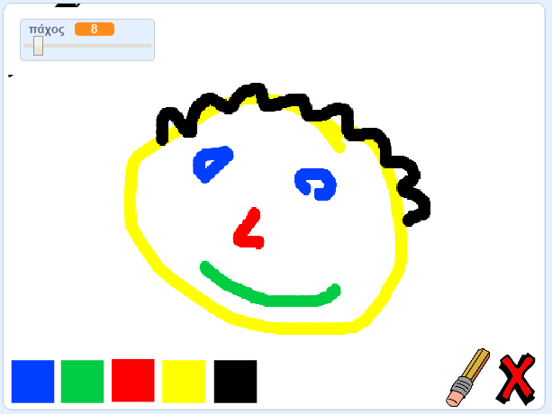

\--- no-print \---

Αυτή είναι η **Scratch 3** έκδοση του έργου. Υπάρχει επίσης η [έκδοση Scratch 2 του έργου](https://projects.raspberrypi.org/en/projects/paint-box-scratch2).

\--- /no-print \---

## Εισαγωγή

Κάνε το δικό σου πρόγραμμα χρωμάτων!

### Τι θα κάνεις

\--- no-print \---

Click on the green flag to start. Use the mouse to move the pencil, and hold down the left mouse button to draw. Click on a colour to change pencils. Click on the eraser to change to it, and use it to erase your work. To clear the page, click on the cross.

  <iframe allowtransparency="true" width="485" height="402" src="//scratch.mit.edu/projects/embed/267243161/?autostart=false" frameborder="0" scrolling="no"></iframe>
  

\--- /no-print \---

\--- print-only \---

You will click on the green flag to start, and you'll use the mouse to move the pencil and hold down the left mouse button to draw. Clicking on a colour will change pencil colours, and clicking on the eraser will change to the eraser!

\--- /print-only \---

## \--- collapse \---

## title: Τι θα μάθεις

+ Πρόσθεσε την επέκταση πένας στο Scratch
+ Χρησιμοποίησε εκπομπές για να ελέγξεις ένα αντικείμενο στο Scratch
+ Recall how to respond to mouse events in Scratch

\--- /collapse \---

## \--- collapse \---

## title: Τι θα χρειαστείς

### Υλικό

+ Ένας υπολογιστής ικανός να τρέχει το Scratch 3

### Λογισμικό

+ Scratch 3 (είτε [online](http://rpf.io/scratchon){:target="_blank"} είτε [offline](http://rpf.io/scratchoff){:target="_blank"})

### Λήψεις

+ [Αρχικό έργο εκτός σύνδεσης](http://rpf.io/p/en/paint-box-go){: target = "_ blank"}

\--- /collapse \---

## \--- collapse \---

## title: Πρόσθετες πληροφορίες για εκπαιδευτικούς

If you need to print this project, please use the [printer-friendly version](https://projects.raspberrypi.org/en/projects/paint-box/print){:target="_blank"}.

You can find the [completed project here](http://rpf.io/p/en/paint-box-get){:target="_blank"}.

\--- /collapse \---