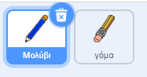
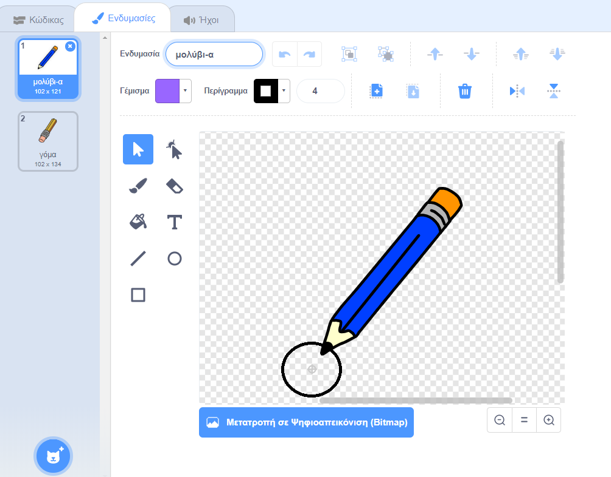

## Δημιούργησε ένα μολύβι

Αρχίζεις δημιουργώντας ένα μολύβι που μπορείς να χρησιμοποιήσεις για να σχεδιάσεις στο Σκηνικό.

\--- task \--- Άνοιξε το αρχικό έργο Scratch 'Κουτί Χρωμάτων'.

**Online:** άνοιξε το αρχικό έργο στο [rpf.io/paint-box-on](http://rpf.io/paint-box-on){:target="_blank"}

Αν έχεις λογαριασμό Scratch μπορείς να κάνεις ένα αντίγραφο, κάνοντας κλικ στο κουμπί **Ανάμειξη**.

**Offline**: άνοιξε το [αρχικό έργο](http://rpf.io/p/en/paint-box-go){:target="_blank"} στον επεξεργαστή εκτός σύνδεσης.

Αν χρειαστεί να κατεβάσεις και να εγκαταστήσεις τον offline editor για το Scratch, μπορείς να τον βρεις στο [rpf.io/scratchoff](http://rpf.io/scratchoff){:target="_blank"}

Στο αρχικό πρόγραμμα, θα δεις αντικείμενα μολυβιού και γόμας:

 \--- /task \---

\--- task \---

Πρόσθεσε την επέκταση πένας στο έργο σου.

[[[generic-scratch3-add-pen-extension]]]

\--- /task \---

\--- task \---

Πρόσθεσε κώδικα στο μολύβι για να κάνεις το αντικείμενο να ακολουθεί τον δείκτη του ποντικιού `για πάντα`{:class="block3control"}, ώστε να μπορείς να σχεδιάσεις:


```blocks3
όταν στην πράσινη σημαία γίνει κλικ
για πάντα 
  πήγαινε σε (mouse pointer v)
end
```

\--- /task \---

\--- task \--- Κάνε κλικ στη σημαία και στη συνέχεια, μετακίνησε το δείκτη του ποντικιού στο σκηνικό για να ελέγξεις ότι ο κώδικας σου λειτουργεί. \--- /task \---

Έπειτα, κάνε το μολύβι σου να σχεδιάζει μόνο `εάν`{:class="block3control"} το κουμπί του ποντικιού έχει πατηθεί.

\--- task \--- Πρόσθεσε αυτόν τον κώδικα στο αντικείμενο μολυβιού:


```blocks3
Όταν στην πράσινη σημαία γίνει κλικ
για πάντα 
  πήγαινε σε (mouse pointer v)
  + εάν <mouse down?> τότε 
  +   κατέβασε πένα
  + αλλιώς 
  +   σήκωσε πένα
  + end
end
```

\--- /task \---

\--- task \--- Δοκίμασε τον κώδικά σου ξανά. Αυτή τη φορά, μετακίνησε το μολύβι στο Σκηνικό κρατώντας πατημένο το αριστερό κουμπί του ποντικιού. Μπορείς να σχεδιάσεις με το μολύβι σου;

 \--- /task \---

## \--- collapse \---

## title: Το μολύβι δεν ζωγραφίζει από την άκρη του;

Εάν η γραμμή που σχεδιάζει το μολύβι σου μοιάζει να προέρχεται από τη μέση του μολυβιού, πρέπει να αλλάξεις το αντικείμενο του μολυβιού σου, έτσι ώστε η άκρη να είναι το κέντρο του αντικειμένου.

Κάνε κλικ στο αντικείμενο μολυβιού και ξανά κλικ στην καρτέλα **Ενδυμασίες**.

Μετακίνησε την ενδυμασία έτσι ώστε η άκρη του μολυβιού να είναι **ακριβώς πάνω** από το κέντρο.



Τώρα μετακίνησε το μολύβι στο Σκηνικό και ζωγράφισε. Το μολύβι τώρα θα ζωγραφίζει μια γραμμή από την άκρη του.

\--- /collapse \---