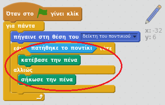
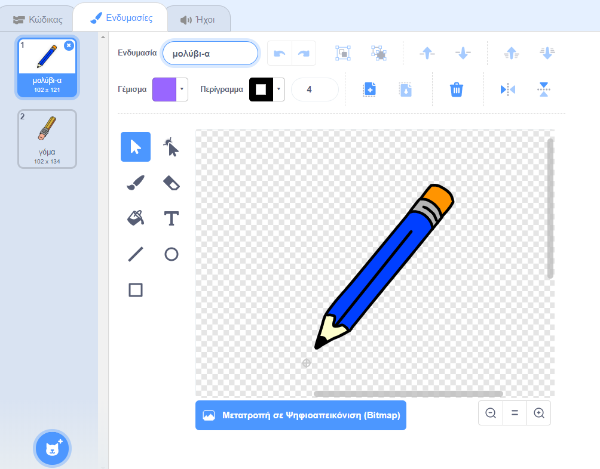

## Κάνοντας ένα μολύβι

Ας αρχίσουμε κάνοντας ένα μολύβι που μπορεί να χρησιμοποιηθεί για να σχεδιάσεις στο σκηνικό.

+ Άνοιξε το έργο Scratch 'Paintbox' online στο [jumpto.cc/paint-go](http://jumpto.cc/paint-go){:target="_blank"} ή κάνε λήψη από το <http://jumpto.cc/paint-get>{:target="_blank"} και στη συνέχεια άνοιξε το, αν χρησιμοποιείς την offline εφαρμογή Scratch.

Θα δεις αντικείμενα μολυβιού και γόμας:


+ Πρόσθεσε κώδικα στο μολύβι για να το κάνεις να ακολουθεί το ποντίκι `για πάντα`{:class="blockcontrol"}, ώστε να μπορείς να σχεδιάσεις:

```blocks
    όταν πατηθεί η σημαία 
   για πάντα, 
      πήγαινε στο [δείκτης ποντικιού]
   τέλος
```

+ Κάνε κλικ στη σημαία και στη συνέχεια, μετακίνησε το ποντίκι στο σκηνικό για να ελέγξεις ότι ο κώδικας λειτουργεί.

Έπειτα, ας κάνουμε το μολύβι σου να σχεδιάζει μόνο `εάν`{:class="blockcontrol"} το ποντίκι έχει πατηθεί.

+ Πρόσθεσε αυτόν τον κώδικα στο αντικείμενο μολύβι:



+ Δοκίμασε ξανά τον κώδικά σου. Αυτή τη φορά, μετακίνησε το μολύβι στο σκηνικό κρατώντας πατημένο το αριστερό κουμπί του ποντικιού. Μπορείτε να σχεδιάσετε με το μολύβι σας;


## \--- κατάρρευση \---

## title: Εάν αντιμετωπίζετε προβλήματα ...

Εάν το μολύβι σας φαίνεται να τραβάει τη γραμμή από τη μέση του μολυβιού αντί της μύτης, θα χρειαστεί να αλλάξετε το κέντρο κοστουμιών σας.



Το κορδόνι για το μολύβι πρέπει να τοποθετηθεί **ακριβώς κάτω από το** το άκρο του μολυβιού, όχι στην άκρη του μολυβιού.

Οι αλλαγές στο 'κέντρο κοστουμιών' ενός sprite δεν έχουν καταχωριστεί μέχρι να γίνει κλικ σε άλλη καρτέλα, οπότε κάντε κλικ σε μια άλλη φορεσιά ή στην καρτέλα 'Scripts' για να ολοκληρώσετε τις αλλαγές στο κέντρο ενδυμασίας.

\--- /κατάρρευση \---