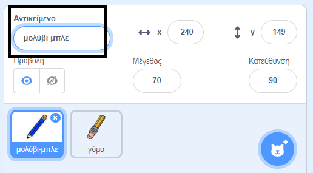
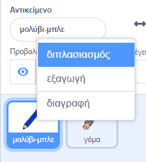
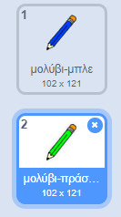
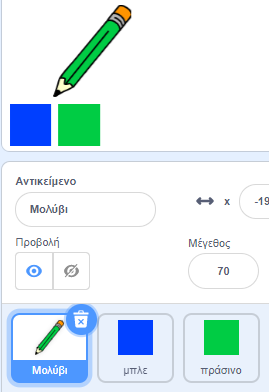

## Χρωματιστά μολύβια

Τώρα θα προσθέσεις διαφορετικά χρωματιστά μολύβια στο έργο σου, επιτρέποντας στο χρήστη να επιλέγει μεταξύ αυτών.

--- task ---

Μετονόμασε το αντικείμενο `μολύβι` σε `μπλε-μολύβι`



--- /task ---

--- task ---

Κάνε δεξί κλικ στο αντικείμενο μολύβι και δημιούργησε ένα αντίγραφο της ενδυμασίας 'μπλε-μολύβι'.



--- /task ---

--- task ---

Μετονόμασε τη νέα ενδυμασία σε «πράσινο-μολύβι» και χρωμάτισε το μολύβι πράσινο.



--- /task ---

--- task ---

Σχεδίασε δύο νέα αντικείμενα - ένα μπλε τετράγωνο και ένα πράσινο τετράγωνο. Αυτά είναι για την επιλογή μεταξύ του μπλε και του πράσινου μολυβιού.



--- /task ---

--- task ---

Μετονόμασε τα αντικείμενά σου έτσι ώστε να ονομάζονται 'μπλε' και 'πράσινο'

[[[generic-scratch3-rename-sprite]]]

--- /task ---

--- task ---

Πρόσθεσε κώδικα στο πράσινο αντικείμενο, έτσι ώστε, όταν κάνεις κλικ σε αυτό τότε να `εκπέμπει`{:class="block3events"} το μήνυμα "πράσινο".


```blocks3
when this sprite clicked
broadcast (πράσινο v)
```

[[[generic-scratch3-broadcast-message]]]

--- /task ---

Το αντικείμενο μολυβιού θα ακούσει το "πράσινο" μήνυμα και θα αλλάξει την ενδυμασία και το χρώμα του μολυβιού ως απόκριση.

--- task ---

Επίλεξε το αντικείμενο μολύβι. Πρόσθεσε κώδικα έτσι ώστε όταν λάβει την εκπομπή `πράσινο`{:class="block3events"}, να αλλάζει στην πράσινη ενδυμασία του και να αλλάζει το χρώμα του σε πράσινο.


```blocks3
when I receive [πράσινο v]
switch costume to (μολύβι-πράσινο v)
set pen color to [#00CC44]
```

Για να ρυθμίσεις το χρώμα μολυβιού στο πράσινο, κάνε κλικ στο έγχρωμο τετράγωνο στο μπλοκ `όρισε το χρώμα της πένας`{:class="block3extensions"}, και στη συνέχεια κάνε κλικ στο αντικείμενο πράσινου τετραγώνου.

--- /task ---

Στη συνέχεια, με παρόμοιο τρόπο, μπορείς να αλλάξεις το χρώμα του μολυβιού σε μπλε.

--- task ---

Κάνε κλικ στο αντικείμενο μπλε τετράγωνο και πρόσθεσε αυτόν τον κώδικα:


```blocks3
when this sprite clicked
broadcast (μπλε v)
```

Στη συνέχεια κάνε κλικ στο αντικείμενο μολυβιού και πρόσθεσε αυτόν τον κώδικα:


```blocks3
when I receive [μπλε v]
switch costume to (μολύβι-μπλε v)
set pen color to [#0000ff]
```

--- /task ---

--- task ---

Τέλος, πρόσθεσε αυτόν τον κώδικα για να πεις στο αντικείμενο μολύβι με ποιο χρώμα πρέπει να ξεκινά και βεβαιώσου ότι η οθόνη είναι καθαρή όταν το πρόγραμμά σου ξεκινά.


```blocks3
when flag clicked
+erase all
+switch costume to (μολύβι-μπλε v)
+set pen color to [#0035FF]
forever
  go to (δείκτη ποντικιού v)
  if <mouse down?> then 
  pen down
  else
  pen up
end
```

--- /task ---

Εάν προτιμάς, μπορείς να ξεκινήσεις με ένα διαφορετικό χρωματιστό μολύβι.

--- task ---

Δοκίμασε τον κώδικά σου. Μπορείς να αλλάζεις ανάμεσα στο μπλε και το πράσινο μολύβι κάνοντας κλικ στο μπλε ή το πράσινο τετράγωνο αντικείμενο;


--- /task ---