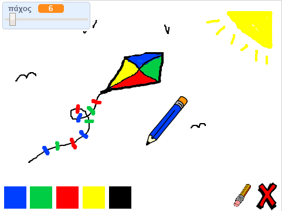

## Πρόκληση: περισσότερα μολύβια

Μπορείς να προσθέσεις κόκκινο, κίτρινο και μαύρο μολύβι στο πρόγραμμα ζωγραφικής; Ρίξε μια ματιά στα προηγούμενα βήματα, αν θέλεις μια υπενθύμιση για το πώς να το κάνεις αυτό.

Μπορείς να χρησιμοποιήσεις τα μολύβια σου για να σχεδιάσεις μια εικόνα;

