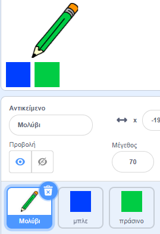

## Χρωματιστά μολύβια

Ας προσθέσουμε διαφορετικά χρωματιστά μολύβια στο έργο σου, επιτρέποντας στο χρήστη να επιλέγει μεταξύ αυτών.

+ Κάνε κλικ στο μολύβι σου, κλικ στο 'Ενδυμασίες' και διπλασίασε την ενδυμασία 'μολύβι-μπλε'.


+ Μετονόμασε τη νέα ενδυμασία σε «μολύβι-πράσινη» και χρωμάτισε το μολύβι πράσινο.


[[[generic-scratch-rename-sprite]]]

+ Σχεδίασε δύο νέα αντικείμενα - ένα μπλε τετράγωνο και ένα πράσινο τετράγωνο. Θα τα χρησιμοποιείς για να επιλέγεις το μπλε ή πράσινο μολύβι.



+ Μετονόμασε τα αντικείμενά σου έτσι ώστε να ονομάζονται 'μπλε' και 'πράσινο'

+ Πρόσθεσε κώδικα στο 'πράσινο' αντικείμενο, έτσι ώστε όταν πατηθεί, να `μεταδίδει`{:class="blockevents"} το μήνυμα "πράσινο" στο αντικείμενο μολύβι, λέγοντάς του να αλλάξει ενδυμασία και χρώμα.


[[[generic-scratch-broadcast-message]]]

+ Επέλεξε το αντικείμενο μολύβι. Πρόσθεσε κώδικα έτσι ώστε όταν λάβει την `μετάδοση`{:class="blockevents"} πράσινο, να αλλάζει στην πράσινη ενδυμασία του και να αλλάζει το χρώμα του σε πράσινο.


Για να ρυθμίσεις το χρώμα του μολυβιού σε πράσινο, κάνε κλικ στο έγχρωμο πλαίσιο στο μπλοκ `όρισε το χρώμα πένας σε`{:class="blockpen"} και στη συνέχεια κάνε κλικ στο πράσινο αντικείμενο για να επιλέξεις το ίδιο πράσινο χρώμα με αυτό του μολυβιού σου.

+ Τώρα μπορείτε να κάνετε το ίδιο και για το μπλε εικονίδιο με το μολύβι: προσθέστε αυτόν τον κώδικα στο μπλε τετράγωνο σπάιτ:

```blocks
όταν αυτό το sprite clicked broadcast [μπλε v]
```

... και προσθέστε αυτόν τον κώδικα στο στυλό μολυβιού:

```blocks
όταν λαμβάνω κοστούμι [μπλε v] διακόπτη σε [μολύβι-μπλε v] ορίσετε το στυλό χρώμα στο [# 0000ff]
```

+ Τέλος, προσθέστε αυτόν τον κωδικό για να πείτε στο στυλό μολυβιού ποιο χρώμα πρέπει να ξεκινήσει και βεβαιωθείτε ότι η οθόνη είναι καθαρή.


Επιλέξαμε να ξεκινήσετε με μπλε χρώμα, αλλά αν προτιμάτε, μπορείτε να ξεκινήσετε με ένα διαφορετικό μολύβι χρώματος.

+ Δοκιμάστε το έργο σας. Μπορείτε να μεταβείτε ανάμεσα σε μπλε και πράσινο στυλό κάνοντας κλικ στο μπλε ή πράσινο τετράγωνο sprites;

